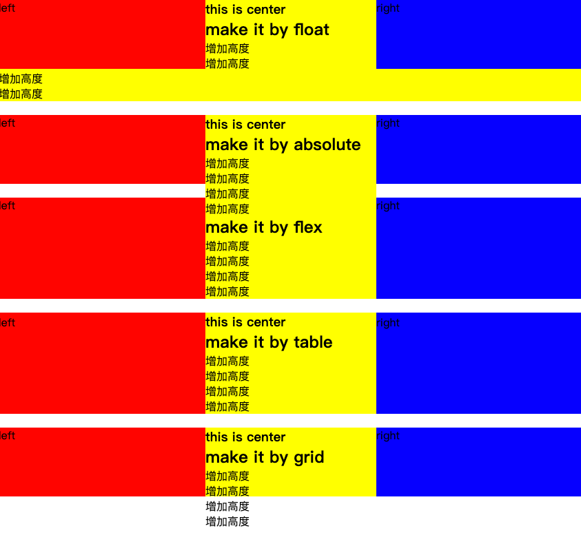

> - [grid布局学习资料](http://www.ruanyifeng.com/blog/2019/03/grid-layout-tutorial.html)
> - [flex布局学习资料](http://www.ruanyifeng.com/blog/2015/07/flex-grammar.html)
> - [table布局学习资料](https://segmentfault.com/a/1190000007007885?utm_source=tag-newest)

::: tip 题目
加入高度已知，请写出三栏布局，其中左栏、右栏宽度各为300px，中间宽度自适应。（emmet语法）
:::
### 延伸：

1. 各自的优缺点
2. 去掉固定高度，各个解决方案是否还有效
3. 真正适合运用到业务中去的方案 

### 回答：

```html
<!DOCTYPE html>
<html lang="en">
<head>
  <meta charset="UTF-8">
  <meta name="viewport" content="width=device-width, initial-scale=1.0">
  <meta http-equiv="X-UA-Compatible" content="ie=edge">
  <title>三栏布局</title>
  <style>
    html * {
      margin: 0;
      padding: 0;
    }
    .layout:not(:first-child) {
      margin-top: 20px;
    }
    .layout div {
      min-height: 100px;
    }
  </style>
</head>
<body>
  <!-- float -->
  <section class="layout float">
    <style>
      .layout.float .left {
        float: left;
        width: 300px;
        background: red;
      }
      .layout.float .right {
        float: right;
        width: 300px;
        background: blue;
      }
      .layout.float .center {
        background: yellow;
      }
    </style>
    <article class="left-center-right">
      <div class="left">left</div>
      <div class="right">right</div>
      <!-- 注意center放在后面 -->
      <div class="center">
        <h1>this is center</h1>
        <h2>make it by float</h2>
        <p>增加高度</p>
        <p>增加高度</p>
        <p>增加高度</p>
        <p>增加高度</p>
      </div>
    </article>
  </section>

  <!-- absolute -->
  <section class="layout absolute">
    <style>
      .layout.absolute .left-center-right {
        position: relative;
      }
      .layout.absolute .left-center-right > div {
        position: absolute;
      }
      .layout.absolute .left {
        left: 0;
        width: 300px;
        background: red;
      }
      .layout.absolute .right {
        right: 0;
        width: 300px;
        background: blue;
      }
      .layout.absolute .center {
        left: 300px;
        right: 300px;
        background: yellow;
      }
    </style>
    <article class="left-center-right">
      <div class="left">left</div>
      <div class="right">right</div>
      <div class="center">
        <h1>this is center</h1>
        <h2>make it by absolute</h2>
        <p>增加高度</p>
        <p>增加高度</p>
        <p>增加高度</p>
        <p>增加高度</p>
      </div>
    </article>
  </section>

  <!-- flex -->
  <section class="layout flex">
    <style>
      .layout.flex {
        margin-top: 140px;
      }
      .layout.flex .left-center-right {
        display: flex;
      }
      .layout.flex .left {
        width: 300px;
        background: red;
      }
      .layout.flex .right {
        width: 300px;
        background: blue;
      }
      .layout.flex .center {
        flex: 1;
        background: yellow;
      }
    </style>
    <article class="left-center-right">
      <div class="left">left</div>
      <div class="center">
        <h1>this is center</h1>
        <h2>make it by flex</h2>
        <p>增加高度</p>
        <p>增加高度</p>
        <p>增加高度</p>
        <p>增加高度</p>
      </div>
      <div class="right">right</div>
    </article>
  </section>

  <!-- table -->
  <section class="layout table">
    <style>
      .layout.table .left-center-right {
        display: table;
        width: 100%;
      }
      .layout.table .left-center-right > div {
        display: table-cell;
      }
      .layout.table .left {
        width: 300px;
        background: red;
      }
      .layout.table .center {
        background: yellow;
      }
      .layout.table .right {
        width: 300px;
        background: blue;
      }
    </style>
    <article class="left-center-right">
      <div class="left">left</div>
      <div class="center">
        <h1>this is center</h1>
        <h2>make it by table</h2>
        <p>增加高度</p>
        <p>增加高度</p>
        <p>增加高度</p>
        <p>增加高度</p>
      </div>
      <div class="right">right</div>
    </article>
  </section>

  <!-- grid -->
  <section class="layout grid">
    <style>
      .layout.grid .left-center-right {
        display: grid;
        grid-template-columns: 300px auto 300px;
      }
      .layout.grid .left {
        background: red;
      }
      .layout.grid .center {
        background: yellow;
      }
      .layout.grid .right {
        background: blue;
      }
    </style>
    <article class="left-center-right">
      <div class="left">left</div>
      <div class="center">
        <h1>this is center</h1>
        <h2>make it by grid</h2>
        <p>增加高度</p>
        <p>增加高度</p>
        <p>增加高度</p>
        <p>增加高度</p>
      </div>
      <div class="right">right</div>
    </article>
  </section>
</body>
</html>
```

 

1. 各自优缺点

	| 方案|优点|缺点|
	|---|---|---|
	| float|处理好清除浮动，兼容性比较好|脱离了文档流，需要处理好清除浮动|
	| absolute|快捷|有效性和可实用性较差，因为脱离文档流，后面的所有dom都要脱离|
	| flex|解决上述两种方案中的问题，相对完美，尤其是移动端|ie8是不支持的 |
	| table|兼容性非常好|出了历史诟病，中间表格高度增加，两边也跟着增加，而有时是不需要增加的|
	| grid|更简单有效地替代网格布局框架，|兼容性差|
	
2. 增加高度后，只有flex布局和table布局就不可以了
	- float布局：如果要修复，需要给中间创建BFC。float布局往左右流的原因是：因为浮动所以有左右有了阻挡，下面没有阻挡，就流到左右两边去了
	- position布局：无解决方案
	- grid布局：去掉 `gird-template-rows` 属性，设置单纯地高度属性 `height`

### 变通：

1. 三栏布局
	1. 左右固定，中间自适应
	2. 上下固定，中间自适应
2. 两栏布局
	1. 左边固定，右边自适应	
	2. 右边固定，左边自适应	
	3. 上边固定，下边自适应	
	4. 下边固定，上边自适应	


### 变通答案

1. 上下固定，中间自适应

```html
<!DOCTYPE html>
<html lang="en">
<head>
  <meta charset="UTF-8">
  <meta name="viewport" content="width=device-width, initial-scale=1.0">
  <meta http-equiv="X-UA-Compatible" content="ie=edge">
  <title>layout</title>
  <style>
    html * {
      margin: 0;
      padding: 0;
    }
    html, body, .layout {
      width: 100%;
      height: 100%;
    }
    html, body, .layout article {
      width: 100%;
      height: 100%;
    }
    .layout div {
      width: 100%;
    }
    .layout .header, .footer {
      height: 60px;
    }
    .layout .header {
      background: red;
    }
    .layout .center {
      background: yellow;
    }
    .layout .footer {
      background: blue;
    }
  </style>
</head>
<body>
  <!-- absolute -->
  <!-- <section class="layout absolute">
    <style>
      .layout .header-center-footer {
        position: relative;
        height: 100%;
      }
      .layout.absolute .center {
        position: absolute;
        top: 60px;
        bottom: 60px;
      }
      .layout.absolute .footer {
        position: absolute;
        bottom: 0;
      }
    </style>
    <article class="header-center-footer">
      <div class="header">header</div>
      <div class="center">
        <h1>center</h1>
        <h2>make it by absolute</h2>
      </div>
      <div class="footer">footer</div>
    </article>
  </section> -->

  <!-- flex -->
  <!-- <section class="layout flex">
    <style>
      .layout.flex .header-center-footer {
        display: flex;
        flex-direction: column;
      }
      .layout.flex .center {
        flex: 1;
      }
    </style>
    <article class="header-center-footer">
      <div class="header">header</div>
      <div class="center">
        <h1>center</h1>
        <h2>make it by flex</h2>
      </div>
      <div class="footer">footer</div>
    </article>
  </section> -->

  <!-- table -->
  <!-- <section class="layout table">
    <style>
      .layout.table .header-center-footer {
        display: table;
        flex-direction: column;
      }
      .layout.table .header-center-footer > div{
        display: table-row;
      }
    </style>
    <article class="header-center-footer">
      <div class="header">header</div>
      <div class="center">
        <h1>center</h1>
        <h2>make it by table</h2>
      </div>
      <div class="footer">footer</div>
    </article>
  </section> -->

  <!-- grid -->
  <section class="layout grid">
    <style>
      .layout.grid .header-center-footer {
        display: grid;
        grid-template-rows: 60px 1fr 60px;
      }
    </style>
    <article class="header-center-footer">
      <div class="header">header</div>
      <div class="center">
        <h1>center</h1>
        <h2>make it by grid</h2>
      </div>
      <div class="footer">footer</div>
    </article>
  </section>
</body>
</html>
```