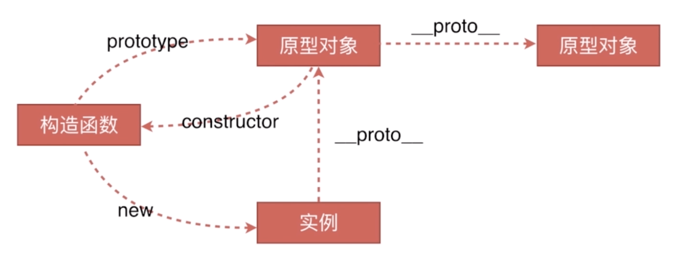
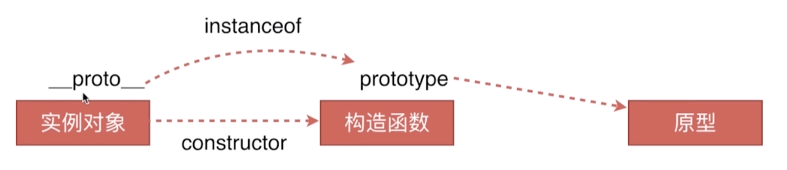

[[toc]]

## 创建对象有几种方法

```javascript
// 方法1（字面量）
var o1 = { name: 'o1' } // 打印输出 { name: "o1" }
// 或
var o11 = new Object({ name: 'o11' }) // 打印输出 { name: "o11" }

// 方法2（构造函数）
var M = function () {
  this.name = 'o2'
}
var o2 = new M() // 打印输出 M { name: "o2" }

// 方法3（Object.create）
var P = { name: 'o3' }
var o3 = Object.create(P) // 打印输出 {}，拿不到name属性，是因为 Object.create 是通过原型链来创建对象的，name在原型链的对象P上
```

## 原型、构造函数、实例、原型链



### instanceof

---



1. 实例对象虽然由构造函数产生，但是实例的 `__proto__` 跟构造函数没什么关系，它关联的是构造函数的 `prototype` 属性所关联的那个原型对象；
2. 其实instanceof的工作原理就是判断左边实例的 `__proto__` 和右边构造函数的 `prototype` 是否一致；
3. 只要是原型链上的对象，`instanceof` 都会返回true，但是可以使用 `constructor` 来判断某实例是否是由某构造函数生成的。

```javascript
const M = function () {}
const m = new M()

// 其实instanceof的工作原理就是判断左边实例的 __proto__ 和右边构造函数的 prototype 是否一致
console.log(m instanceof M) // true 
// 只要是这个原型链上的对象，都会返回true
console.log(m instanceof Object) // true

// constructor 是指创建这个实例的构造函数
console.log(m.constructor === M) // true
console.log(m.__proto__.constructor === M) // true
```

### new 运算符

new 实际上会经历四个步骤：
1. 创建一个新对象；
2. 将构造函数的作用域赋给新对象（this指向了这个新对象）；
3. 执行构造函数中的代码（为这个新对象添加构造函数的属性）；
4. 返回新对象。

可以代码来实现上面的四个步骤：

1. 一个新对象被创建，它继承自Foo.prototype
2. 构造函数Foo被执行，执行的时候，相应的传参会被传入，同时上下文this会被指定为这个新对象（实例对象）。new Foo 等同于 new Foo()（只能用在不传参数的时候）
3. 如果构造函数返回的是一个对象，那么这个对象会取代整个new出来的结果。如果构造函数没有返回对象，那么new出来的结果为步骤1创建的对象

```javascript
// new运算符的执行过程
const new2 = function (Foo) {
  // 一个新对象被创建，它继承自Foo.prototype
  const o = Object.create(Foo)
  // 构造函数foo被执行，执行的时候，相应的传参会被传入，同时上下文this会被指定为这个新对象（实例对象）。new Foo 等同于 new Foo()（只能用在不传参数的时候）
  const k = Foo.call(o)

  // 如果构造函数返回的是一个对象，那么这个对象会取代整个new出来的结果。如果构造函数没有返回对象，那么new出来的结果为步骤1创建的对象
  if (typeof k === 'object) {
    return k
  } else {
    return o
  }
}
```
