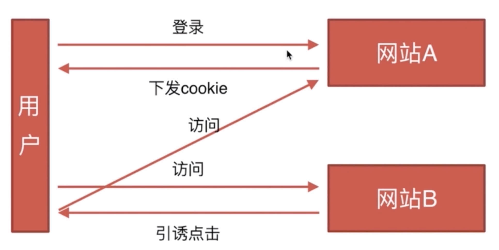

[[toc]]

## CSRF

#### 基本概念和缩写

通常成为跨站请求伪造，英文名字：Cross-site request forgery

#### 攻击原理

前提：
1. 某个接口确实存在这种漏洞
2. 用户在网站A确实处于登录状态

#### 防御措施

- Token 验证
- Referer验证
- 隐藏令牌

> 学习资料：https://www.cnblogs.com/hyddd/archive/2009/04/09/1432744.html

## XSS

#### 基本概念和缩写

Cross-site scripting跨域脚本攻击 

> https://www.imooc.com/learn/812

#### 攻击方式

1. 反射型  
    发出请求时，XSS代码出现在URL中，作为出入提交到服务器，服务器端解析后响应，XSS代码随响应内容一起传回浏览器，最后浏览器解析执行期执行XSS代码。这个过程像一次反射，故叫反射型。
2. 存储型  
    存储型XSS和反射型XSS的差别仅在于，提交的代码会存储在服务端（数据库、内存，文件系统等），下次请求目标页面时不用再提交XSS代码。

#### 防御措施

1. 编码  
   对用户输入的数据进行HTML Entity编码
2. 过滤  
   移除用户上传的DOM属性，如onerror等  
   移除用户上传的style节点、script节点、iframe节点等
3. 矫正  
   避免直接对HTML Entity解码  
   使用DOM Parse转换，校正不匹配的DOM标签

## 区别

CSRF是利用本身的漏洞自动触发接口，XSS是向页面注入js，然后在函数体中去操作 
