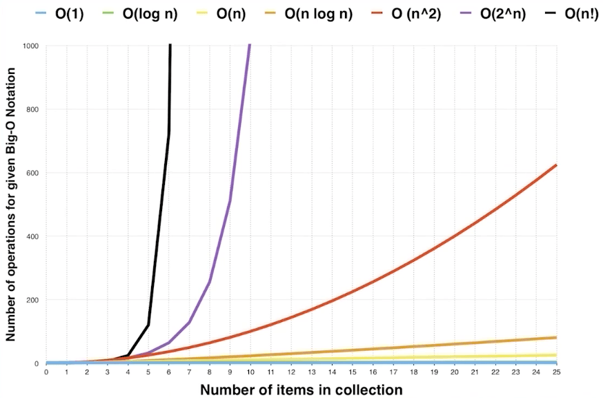
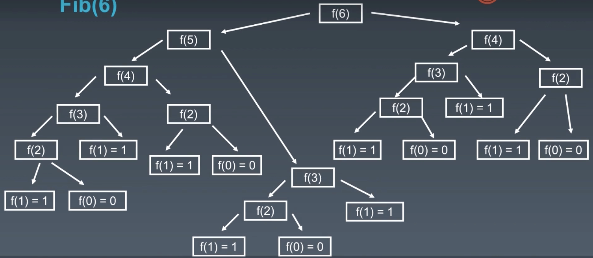

## 复杂度分析

复杂度使用 `Big O notation` 表示，比如 `O(1)` 常数复杂度。

忽略系数：比如，代码执行一次时间复杂度为 `O(1)`，代码执行两次时间复杂度按理说应该为 `O(2)`，但是实际上要忽略这个 `2` 的，仍然用 `O(1)` 表示；线性复杂度，不管执行了几个 `n` 次，都是用 `O(n)` 表示，而不是用 `O(2n)` 、 `O(3n)` ...，所有复杂度都适用。

### 时间复杂度

#### 常见的时间复杂度

|符号|描述|备注|
|:-:|-|-|
|O(1)|Constant Complexity 常熟复杂度||
|O(log n)|Logarithmic Complexity 对数复杂度||
|O(n)|Linear Complexity 线性时间复杂度||
|O(n^2)|Square Complexity 平方复杂度||
|O(n^3)|Cubic Complexity 立方复杂度||
|O(2^n)|Exponential Complexity 指数复杂度||
|O(n!)|Factorial Complexity 阶乘复杂度||

> 只看最高复杂度的运算

#### 如何判断时间复杂度

最常用的办法是，判断这个函数或这段代码块。根据 n 的不同情况，会运行多少次。

```js
/** 
 * 案例1
 * n 不管为多少，代码都只运行了 1 次，所以时间复杂度为 O(1)
 */
const n = 1000
console.log(n)

/** 
 * 案例2
 * n 不管为多少，代码都运行了 3 次，时间复杂度为 O(1)
 * 其实可以可以说实际的复杂度为 O(3)，但是忽略系数，只会说是 O(1)
 */
const n = 1000
console.log(`1-${n}`)
console.log(`2-${n}`)
console.log(`3-${n}`)

/** 
 * 案例3
 * 循环导致代码执行了 n 次，时间复杂度为 O(n)
 */
for (let i = 0; i < n; i++) {
  console.log(i)
}

/** 
 * 案例4
 * 循环嵌套，代码执行了 n 的平方次，时间复杂度为 O(n^2)
 */
for (let i = 0; i < n; i++) {
  for (let j = 0; j < n; j++) {
    console.log(j)
  }
}

/** 
 * 案例5
 * 循环嵌套不嵌套，代码执行了 2n 次，省略系数，时间复杂度为 O(n)
 */
for (let i = 0; i < n; i++) {
  console.log(i)
}
for (let j = 0; j < n; j++) {
  console.log(j)
}

/** 
 * 案例6
 * n = 2，执行 2 次，n = 8，执行 3 次，所以执行 log2(n)次，省略系数，时间复杂度为 O(log(n))
 */
for (let i = 1; i < n; i = i * 2) {
  console.log(i)
}

/** 
 * 案例7
 * 求斐波那契数列，运用递归，时间复杂度为 O(k^n)，k 实际为2
 */
function fib (n) {
  if (n < 2) return n
  return fib(n - 1) + fib(n - 2)
}
```

#### 时间复杂度的影响



从上图可以看出，当 n 的数值变大时，不同的时间复杂度影响很大，所以优化时间复杂度尤为重要。

例如这样一个题目：求 1 + 2 + 3 + ... + n 的和：

```js
// 循环 O(n)
function solation1 (n) {
  let result = 0
  for (let i = 1; i < n + 1; i++) {
    result += i
  }
  return result
}

// 数学公式 O(1)
function solation2 (n) {
  return n * (n + 1) / 2
}
```

利用数学公式，时间复杂度会小很多。

#### 递归

```js
// 最原始的方法
function fib (n) {
  if (n < 2) return n
  return fib(n - 1) + fib(n - 2)
}
```

如果我们求斐波那契数列的第六位，实际运行路径是下面这样的：



运行次数大约是 2 的 n 次幂，所以时间复杂度是 O(2^n)。优化的方法就是过程缓存，或者是用普通的循环依次相加，来减少函数运行次数，从而降低时间复杂度。

```js
// 缓存过程，只比原始方法小一点
function fib2 (n) {
  const arr = [0, 1, 1]
  if (n < 2) return arr[n]
  const prev = arr[n - 1] ? arr[n - 1] : fib2(n - 1)
  const next = arr[n - 2] ? arr[n - 2] : fib2(n - 2)
  return prev + next
}

// 循环直接将时间复杂度降到了 O(n)，所以小了很多
function fib3 (n) {
  const arr = [0, 1, 1]
  if (n < 2) return arr[n]
  for (let i = 2; i < n +1;i++) {
    arr[i] = arr[i-1] + arr[i-2]
  }
  return arr[n]
}
```

#### 主定理

主定理用来方便计算递归所有情况的时间复杂度。

|递归|公式|时间复杂度|描述|
|-|-|-|-|
|二分查找|T(n) = T(n/2) + O(1)|O(log n)|每次查找一分为二，只查一边|
|二叉树查找|T(n) = 2T(n/2) + O(1)|O(n)|每个节点访问一次且只访问一次|
|二位数组进行二分查找|T(n) = 2T(n/2) + O(log n)|O(n)|一维数组就是 O(log n)，二维数组就是 O(n)|
|归并排序|T(n) = 2T(n/2) + O(n)|O(n log n)|这是最优归并排序|

#### 思考题

Q: 二叉树遍历的前序、中序、后序：时间复杂度分别是多少？

A: 每个节点访问一次且只访问一次，所以 O(n)

Q: 图片的遍历的时间复杂度分别是多少？

A: O(n)

Q: 搜索算法：DFS（时间优先）、BFS（广度优先）的时间复杂度分别是多少？

A: O(n)，因为两者的节点都是只访问一次

### 空间复杂度

1. 如果有数组，数组的长度即是空间复杂度
2. 如果有递归，递归的深度即是空间复杂度
3. 如果既有数组又有递归，二者的最大值即是空间复杂度

[案例](https://leetcode-cn.com/problems/climbing-stairs/solution/pa-lou-ti-by-leetcode/)

```js
// 时间复杂度中优化斐波那契数列，我们借用的数组，空间复杂度比较高，其实还可以这么优化为 O(1)
function fib4 (n) {
  const arr = [0, 1, 1]
  if (n < 2) return arr[n]
  let prev = 0
  let next = 1
  for (let i = 2; i < n +1;i++) {
    let result = prev + next
    prev = next
    next = result
  }
  return next
}
```

## 数组、链表和跳表

### 数组

当声明一个数组的时候就是在内存中开辟了一段连续的地址，数组的每一个值都对应一个指针，所以查找某个值时间复杂度为 O(1)。

当删除和插入某个值得时候，就需要挪动要改变的值得后面的所有值。当然也分情况，当在头部插入一个值，后面的所有值都要向后挪动，所以这时的时间复杂度为 O(n)；当在尾部插入一个值，前面的值都不需要挪动，所以这时的时间复杂度为 O(1)。

### 链表

- [JS中的算法与数据结构——链表(Linked-list)](https://www.jianshu.com/p/f254ec665e57)

## 十大排序

### 冒泡排序

::: tip 算法描述
1. 比较相邻元素，如果后者比前者大则交换位置；
2. 从头开始向后依次进行，这样在最后元素就是最大的数；
3. 针对所有的元素，重复以上的步骤(除去每一轮的最后一个：因为每次比较完成后的最后一个数在所比较的所有数里，一定是最大的，所以下一次循环比较就无需比较上一轮的最后一个数)；
4. 重复步骤1～3，直到排序完成。
:::

#### 实现方法

```js
function bubbleSort (arr) {
  let length = arr.length
  for (let i = 0; i < length; i++) {
    for (let j = 0; j < length - i - 1; j++) {
      if (arr[j] > arr[j + 1]) {
        [arr[j], arr[j + 1]] = [arr[j + 1], arr[j]]
      }
    }
  }
  return newArr
}
```

上面的方法，每次循环都是将上次的循环数据的最后一个数据省略掉，这样还是会有一些重复运算。每次排序后，记录下最后一次交换的位置，因为在这之后的数字已经排好序了，因此不需要再次进行比较。

```js
function bubbleSort (arr) {
  let lastIndex = arr.length - 1
  while (lastIndex > 0) {
    let pos = 0
    for (let i = 0; i < lastIndex; i++) {
      if (arr[i] > arr[i + 1]) {
        pos = i
        let temp = arr[i + 1]
        arr[i + 1] = arr[i]
        arr[i] = temp
      }
    }
    lastIndex = pos
  }
  return arr
}
```