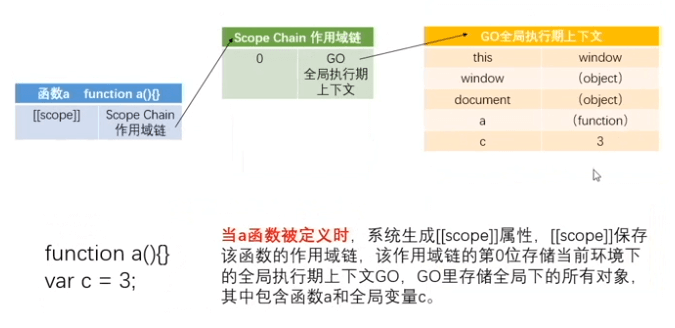
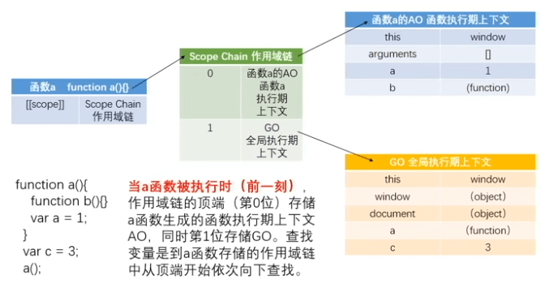
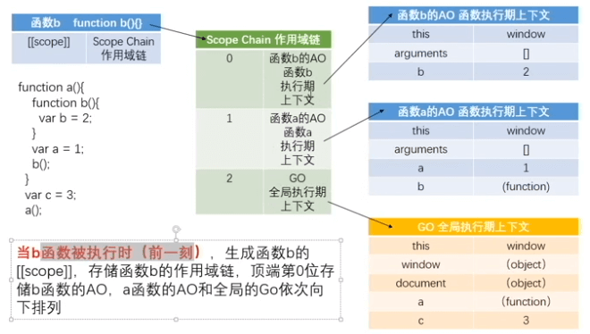
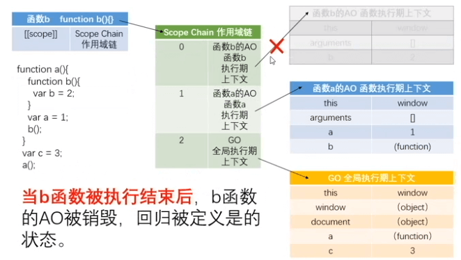
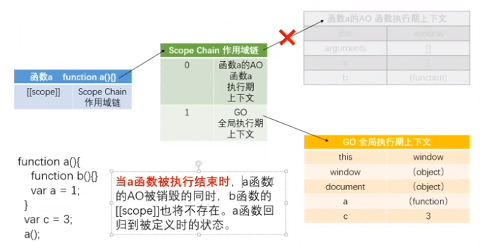
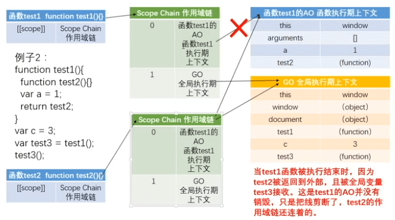
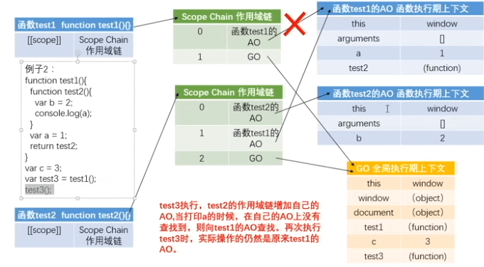
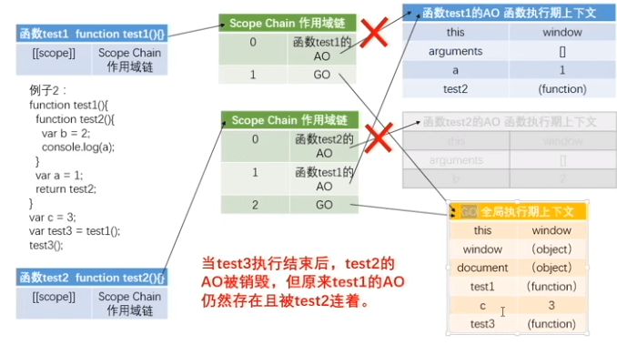

## 数据类型

- **值类型** 值保存在栈内存 Stack 中
- **引用类型** 值保存在堆内存 Heap 中，然后将堆内存的地址保存在栈内存中，并赋值给变量

## typeof

`typeof` 的结果都是字符串。

|案例|结果|
|-|:-:|
|`'1'`|string|
|`1`|number|
|`undefined`|undefined|
|false|boolean|
|Symbol(1)|symbol|
|`null` / {} / []|object|
|Array/Boolean/String/Number/...|function|


## 运算符

|案例|结果|
|-|:-:|
|+ '123'|123|
|- '123'|-123|

> (1, 2) 中 `,` 也是运算符，永远返回最后一个 `,` 后面的值

## 显示类型转换

**Number()**

|案例|结果|
|-|:-:|
|123|123|
|'123'|123|
|'true' / 'a' / '1a' / 'a1' / undefined|NaN|
|true|1|
|false / null|0|

**parseInt()**

`parseInt` 只会将数字类型转化整型

|案例|结果|
|-|:-:|
|123|123|
|true / false / null /undefined|NaN|
|'3.14' / '3.15'|3|
|'123abc'|123|
|'abc123'|NaN|

`parseInt` 接受两个参数，第二个是radix（进制，表示将第一个参数的进制数)。

```js
parseInt(10, 8) // 8
parseInt(10, 2) // 2
parseInt(17, 16) // 23
parseInt(3, 2) // NaN
```

**parseFloat()**

|案例|结果|
|-|:-:|
|3.1415|3.1415|
|'3.1415'|3.1415|

**toFixed()**

toFixed(2) 的结果

|案例|结果|
|-|:-:|
|3.1415|3.14|
|3.1465|3.15|

::: details toFixed() 和 Math.round() 及保留两位小数
**一、toFixed()**

1. toFixed并非四舍五入，而是四舍六入，是银行家的舍入规则;
2. 四舍六入五考虑，五后非零就进一，五后为零看奇偶，五前为偶应舍去，五前为奇要进一。

```js
(0.356).toFixed(2)=0.36
(0.355).toFixed(2)=0.36
(0.3451).toFixed(2)=0.35
(0.3450).toFixed(2)=0.34
```

**二、Math.floor()**

向下取整，不管超过5不超过5，都要舍去。

```js
Math.floor(1.4)=1
Math.floor(1.6)=1
```

**三、Math.ceil()**

向上取整，不管超过5不超过5，都向上取整。

```js
Math.ceil(1.4)=2
Math.ceil(1.6)=2
```

**四、Math.round()**

是真正意义上的四舍五入。

```js
Math.round(1.4)=1
Math.round(1.6)=2
```

**五、保留两位小数**

```js
function twoDecimal (x) {
  let f = parseFloat(x)
  if (isNaN(f)) {
    return false
  }
  f = Math.round(x * 100) / 100
  let s = f.toString()
  let rs = s.indexOf('.')
  if (rs < 0) {
    rs = s.length
    s += '.'
  }
  while (s.length <= rs + 2) {
    s += '0'
  }
  return s
}
```
:::

**toString()**

toString 接受两个参数，第二个是radix（进制)

数值、布尔值、对象、字符串和 Symbol 都有一个 toString() 方法，但是 null 和 undefined 没有。

**String()**

如果值有 toString() 方法，就会遵循其规则转化，如果是 `'null'` 返回 null，如果是 undefined 返回 `'undefined'`。

**Boolean()**

|案例|结果|
|-|:-:|
|null / undefined / NaN / '' / 0 / false |false|
|123|true| 
|'1'|true| 
|'0'|true| 
|0|false| 

## 隐式类型转换

|案例|结果|
|-|:-:|
|a++ / a-- / * / `/` / % / = / !=|先 `Number(a)`|
|"a" + 1|先 `String(1)` 再 `'a' + '1'`|
|1 > '2' / '1' > 2 / '1' > '2' / < / <= / >=|先 `Number(1)`|
|'a' > 'b' / < / <= / >=|先转化 ascii 码|
|NaN == NaN / NaN === NaN|false|
|undefined < 0 / undefined > 0 / undefined = 0|false|
|null < 0 / null > 0 / null = 0|false|
|NaN == undefined|true|
|NaN === undefined|false|

**isNaN**

进行 Number() 转化

|案例|结果|
|-|:-:|
|1 / '1' / null|false|
|'a' / undefined / NaN|true|

## ASCII码

表1 0-127
表2 128-255

每个码1个字节

## UNICODE码

涵盖 ASCII 码，从256开始2个字节

str.charCodeAt(0) 查找字节数

**获取字节数**

```js
function getBytes (str) {
  let bytes = 0
  for( let i = 0; i < str.length; i++ ) {
    const pos = str.charCodeAt(i);
    if (pos < 255) {
      bytes++
    } else {
      bytes += 1
    }
  }

  return bytes
}
```

```js
// 精简
function getBytes (str) {
  let bytes = str.length
  for( let i = 0; i < str.length; i++ ) {
    const pos = str.charCodeAt(i);
    if (pos > 255) {
      bytes++
    }
  }

  return bytes
}
```

## 函数

一个固定的功能或者是程序段被封装的过程，实现一个固定的功能或者是程序

### 作用

- 耦合：重复代码太多
- 封装的原则：高内聚，低耦合  ->   模块的单一责任制
- 解耦合：函数，封装

### 变量定义

```js
function test () {
  var a = b = 1
  console.log(a, b)
}
test() // 输出 1 1
console.log(b) // 输出 1，因为相当于先 b = 1，再 var a = b，这样 b 就挂在 window 上了，外面是可以访问的
```

### 声明

函数声明有两种：函数声明和匿名函数表达式（也叫函数字面量）

函数表达式如果给匿名函数加上名字，名字在函数外是无法访问的，但在函数内可以

```js
var test = fuction test1 () {
  test1() // 运行
}
test1() // 报错
test() // 运行
```

### 参数

```js
var test = fuction (a, b) {
  console.log(test.length) // 获取形参的数量
  console.log(arguments.length) // 获取实参的数量
  // 获取函数本身，不推荐，因为递归调用会获取到不同的this值，用命名函数表达式可以解决
  console.log(arguments.callee) 
}
test(1)
```

> 实参没有传的值，形参是 undefined，无法修改，传递的实参就可以

#### 参数未知时的面试题

- 求和
- 依次打印

将伪数组变为数组的方法：

```js
function test () {
  console.log([...arguments].join(''))
  console.log(Array.from(arguments).join(''))
  console.log([].slice.apply(arguments).join(''))
  console.log([].slice.call(arguments).join(''))
  console.log([].splice.call(arguments, 0, arguments.length).join(''))
  console.log([].splice.apply(arguments, [0, arguments.length]).join(''))
}
test(1, 2, 'a')
```

#### 参数默认值

**ES6**

```js
fuction test (a = 1, b = 2) {}

// 如果只想修改 b 的值，可以将 a 赋值 undefined
test(undefined, 4)
```

**ES5**

```js
fuction test (a, b) {
  // 方法1
  var a = arguments[0] || 1
  var b = arguments[1] || 2

  // 方法2，不推荐，推荐使用 arguments
  var a = a || 1
  var b = b || 2

  // 方法3
  var a = typeof(arguments[0]) !== 'undefined' ? arguments[0] : 1
  var b = typeof(arguments[1]) !== 'undefined' ? arguments[1] : 1
}
```

### return

函数末尾默认添加 return

### 全局变量和函数

变量未声明，使用会报错：xxx is not defined，可以使用 typeof(xxx) 先判断类型再使用，未声明则返回undefined

### 递归

```js
// 阶乘
// 1. 找到规律
// 2. 找到出口
fuction test (num) {
  if (num === 1) return 1
  return num * test(n - 1)
}
```

### 立即执行函数

IIFE - immediately-invoked function expression

```js
// 常见
(function () {

})()

// W3C推荐
(function () {

}())
```

**引申**

> 切记：只有表达式才可以执行。

```js
// 报错 Uncaught SyntaxError: Function statements require a function name
function () {
  console.log(1)
}()

// 1
var test = function () {
  console.log(1)
}()

// 报错 Uncaught SyntaxError: Unexpected token ')'
function test () {
  console.log(1)
}()
```

```js
// 立即销毁
var test = function () {
  console.log(1)
}()
console.log(test)
// 1, 立即执行
// undefined, 说明立即执行后销毁
// 如果不是立即执行，会打印函数本身
```

```js
// 函数声明变表达式的方法：+ - ! || &&
+ function () {
  console.log(1)
}()

// NaN
```

```js
function test () {
  console.log(1)
}(1)

// 打印 1，不报错，因为后面的小括号里面有值，小括号会理解为是一个表达式而不是立即执行函数
```

### call/apply

```js
function Car (brand, color) {
  this.brand = brand
  this.color = color
}
var newCar = {}

Car.call(newCar, 'benz', 'black')
// 或者 Car.apply(newCar, ['benz', 'black'])

console.log(newCar) // { brand: 'benz', color: 'black' }
```

```js
function Computed () {
  this.plus = function (a, b) {
    console.log(a + b)
  }
  this.minus = function (a, b) {
    console.log(a - b)
  }
}

function FullCompute () {
  Computed.apply(this)

  this.mul = function (a, b) {
    console.log(a * b)
  }
  this.div = function (a, b) {
    console.log(a / b)
  }
}

const compute = new FullCompute()
compute.plus(1, 2)
compute.minus(1, 2)
compute.mul(1, 2)
compute.div(1, 2)
```

### bind

```js
const p1 = {
  name: '张三',
  hobby: this.hobby,
  play (sex, age) {
    console.log(`年龄为${age}岁，性别为${sex}的${this.name}喜欢${this.hobby}`)
  }
}

const p2 = {
  name: '李四',
  hobby: '踢足球'
}

// call/apply 改变 this 并立即执行
p1.play.call(p2, '男', 18)
p1.play.apply(p2, ['男', 18])

// bind 改变 this 后返回一个新的函数，不会立即执行
const fn = p1.play.bind(p2, '男', 18)
fn()
```

下面来一个例子来讲解 bind 的使用：

```js
<!DOCTYPE html>
<html lang="en">
<head>
  <meta charset="UTF-8">
  <meta name="viewport" content="width=device-width, initial-scale=1.0">
  <meta http-equiv="X-UA-Compatible" content="ie=edge">
  <title>Document</title>
  <style>
    .clearfix::after {
      display: block;
      width: 0;
      content: '';
      clear: both;
    }
    .wrap {
      margin: 50px auto;
      width: 500px;
      height: 500px;
      box-shadow: 0 0 5px #999;
    }
    .tab .t-item {
      cursor: pointer;
      float: left;
      width: 25%;
      height: 50px;
      line-height: 50px;
      text-align: center;
    }
    .tab .t-item.active {
      background: #999;
      color: #fff;
    }
    .page {
      position: relative;
      width: 100%;
      height: 450px;
    }
    .page .p-item {
      position: absolute;
      width: 100%;
      height: 100%;
      text-align: center;
      line-height: 450px;
      display: none;
    }
    .page .p-item.active {
      display: block;
    }
  </style>
</head>
<body>
  <div class="wrap">
    <div class="tab clearfix">
      <div class="t-item active">选项1</div>
      <div class="t-item">选项2</div>
      <div class="t-item">选项3</div>
      <div class="t-item">选项4</div>
    </div>
    <div class="page">
      <div class="p-item active">页面1</div>
      <div class="p-item">页面2</div>
      <div class="p-item">页面3</div>
      <div class="p-item">页面4</div>
    </div>
  </div>
  <script>
    ;(function () {
      const Tab = function () {
        this.tab = document.querySelector('.tab')
        this.tabs = document.querySelectorAll('.t-item')
        this.pages = document.querySelectorAll('.p-item')
      }

      Tab.prototype = {
        init () {
          this.bindEvent()
        },
        bindEvent () {
          this.tab.addEventListener('click', this.tabClick, false)
        },
        tabClick (e) {
          console.log(this) // tab
        }
      }

      return new Tab().init()
    })();
  </script>
</body>
</html>
```

上面点击事件的打印的 this 是 this.tab，但是我需们其打印的是 Tab 的实例，所以可以这样调整：

```js
 Tab.prototype = {
  bindEvent () {
    this.tab.addEventListener('click', this.tabClick.bind(this), false)
  },
  tabClick (e) {
    console.log(this)
  }
}
```

因为这里的事件是在点击之后才执行，所以不能立即执行，用 bind 来改变 this 指向。也可以在外边包裹一层函数，然后在绑定事件之前就保存 this：

```js
 Tab.prototype = {
  bindEvent () {
    const _this = this
    this.tab.addEventListener('click', function () {
      _this.tabClick.()
    }, false)
  },
  tabClick (e) {
    console.log(this) // tab
  }
}
```

或者是使用箭头函数来改变 this 指向：

```js
 Tab.prototype = {
  bindEvent () {
    this.tab.addEventListener('click', () => {
      this.tabClick()
    }, false)
  },
  tabClick (e) {
    console.log(this) // tab
  }
}
```

**总结：在函数套函数、闭包、绑定事件时都会遇到这种情况。**

下面要完善上面这个项目：

```js
 Tab.prototype = {
  tabClick (e) {
    var e = e || window.event,
        tar = e.target || e.srcElement,
        className = tar.className,
        oTabs = this.tabs,
        oPages = this.pages,
        len = oTabs.length,
        thisIndex = Array.prototype.indexOf.call(oTabs, tar), // oTabs 是伪数组
        // thisIndex = Array.from(oTabs).indexOf(tar), // 处理伪数组
        // thisIndex = [...oTabs].indexOf(tar), // 处理伪数组
        tItem, pItem; 
    
    if (className === 't-item') {
      for (var i = 0; i < len; i++) {
        tItem = oTabs[i];
        pItem = oPages[i];

        tItem.className = 't-item';
        pItem.className = 'p-item';
      }

      oTabs[thisIndex].className += ' active';
      oPages[thisIndex].className += ' active';
    }
  }
}
```

---

再来通过 bind 研究一下 this：

```js
const p = { age: 18 }

function Person () {
  console.log(this)
}

Person(); // Window
Person.call(p); // { age: 18 }

new Person() // Person {}

const Person2 = Person.bind(p); // 相当于是 new Person()
new Person2() // Person {}
```

**重点重点重点：**

从上可以看出，最外层函数的 this 是指向 window 的，但是函数作为构造函数通过 new 实例化后，this 是指向实例对象的。

有意思的是，函数通过 bind 改变 this 指向后再去实例化（bind 在改变 this 指向后后返回一个新的函数），并无变化，this 指向还是实例对象。

说明 bind 只是改变函数作为普通函数时的 this 指向，当作为构造函数进行实例化时，不受 bind 影响。

**模拟 bind：**

```js
const p = { age: 18 }

function Person () {
  console.log(this)
}

Function.prototype.bindy = function (context) {
  // this: Person
  // context: p
  const _this = this 
  return function () {
    _this.apply(contxnt)
  }
}

Person.bindy(p)()
```

函数是可以传参数的：

```js
const p = { age: 18 }

function Person (name, sex) {
  console.log(this)
}

Function.prototype.bindy = function (context) {
  // this: Person
  // context: p
  const _this = this,
        args = Array.prototype.slice.call(arguments, 1); // 除去第一个参数 context
  return function () {
    const newArgs = Array.prototype.slice.call(arguments);
    _this.apply(contxnt, args.concat(newArgs))
  }
}

Person.bindy(p, 'reco')('男')
Person.bindy(p, 'reco', '男')()
```

**虽然可以模拟了，但是其如果作为构造函数运行时就出现问题了：**

但是这个时候还有另一个问题：

```js
const p = { age: 18 }

function Person (name, sex) {
  console.log(this)
}

Function.prototype.bindy = function (context) {
  const _this = this,
        args = Array.prototype.slice.call(arguments, 1); // 除去第一个参数 context
  return function () {
    const newArgs = Array.prototype.slice.call(arguments);
    _this.apply(context, args.concat(newArgs))
  }
}

const person2 = Person.bindy(p, 'reco')
new person2('男') // { age: 18 }
```

当作为构造函数的时候应该是打印 `fn {}` 才对，这说明影响到了构造函数：

```js
const p = { age: 18 }

function Person (name, sex) {
  console.log(this)
}

Function.prototype.bindy = function (context) {
  const _this = this,
        args = Array.prototype.slice.call(arguments, 1); // 除去第一个参数 context
  return function () {
    const newArgs = Array.prototype.slice.call(arguments);
    // _this.apply(context, args.concat(newArgs))

    // 这个时候应该判断当前 this 是否是由 Person 构造出来的，如果是，说明正在进行实例化，此时应该将 this 指向 Person
    _this.apply(this instanceof _this ? this : context, args.concat(newArgs))
  }
}

const person2 = Person.bindy(p, 'reco')
new person2('男') // { age: 18 }
```

因为返回出来的函数是由的原型是 `Object`，所以还需求纠正一下构造器：

```js
const p = { age: 18 }

function Person (name, sex) {
  console.log(this)
}

Function.prototype.bindy = function (context) {
  const _this = this,
        args = Array.prototype.slice.call(arguments, 1); // 除去第一个参数 context
  const fn = function () {
    const newArgs = Array.prototype.slice.call(arguments);
    // _this.apply(context, args.concat(newArgs))

    // 这个时候应该判断当前 this 是否是由 Person 构造出来的，如果是，说明正在进行实例化，此时应该将 this 指向 Person
    _this.apply(this instanceof _this ? this : context, args.concat(newArgs))
  }

  fn.prototype = this.prototype

  return fn
}

const person2 = Person.bindy(p, 'reco')
new person2('男') // { age: 18 }
```

因为 `person2` 就是里面返回的 `fn`，所以 `new person2()` 就是 `new fn()`，而 `fn` 的原型是 `Object`，所以 `this instanceof _this` 永远为 `false`，若想为 `true`，让 `fn.prototype` 等于 `Person.prototype`，既可以进行比较，所以使用 `fn.prototype = this.prototype`。

下面还有可以优化的地方（需要借助“圣杯模式”来解决）：

```js
const p = { age: 18 }

function Person (name, sex) {
  console.log(this)
}

Person.prototype.num = 1

Function.prototype.bindy = function (context) {
  const _this = this,
        args = Array.prototype.slice.call(arguments, 1);
  const fn = function () {
    const newArgs = Array.prototype.slice.call(arguments);
    _this.apply(this instanceof _this ? this : context, args.concat(newArgs))
  }

  // fn.prototype.num = 2
  // console.log(this.prototype.num) // 1

  fn.prototype = this.prototype

  // fn.prototype.num = 2
  // console.log(this.prototype.num) // 2

  return fn
}

const person2 = Person.bindy(p, 'reco')
new person2('男')
```

说明 `Person` 和 `fn` 的 `prototype` 同时在修改，下面使用“圣杯模式”来解决：

```js
const p = { age: 18 }

function Person (name, sex) {
  console.log(this)
}

Person.prototype.num = 1

Function.prototype.bindy = function (context) {
  const _this = this,
        args = Array.prototype.slice.call(arguments, 1),
        tempFn = function () {};
  const fn = function () {
    const newArgs = Array.prototype.slice.call(arguments);
    _this.apply(this instanceof _this ? this : context, args.concat(newArgs))
  }

  // fn.prototype.num = 2
  // console.log(this.prototype.num) // 1

  tempFn.prototype = this.prototype

  fn.prototype = new tempFn()

  // fn.prototype.num = 2
  // console.log(this.prototype.num) // 1

  return fn
}

const person2 = Person.bindy(p, 'reco')
new person2('男')
```

最终呈现的终极 bind 模仿代码：

```js
Function.prototype.bindy = function (context) {
  const _this = this,
        args = Array.prototype.slice.call(arguments, 1),
        tempFn = function () {};

  const fn = function () {
    const newArgs = Array.prototype.slice.call(arguments);
    _this.apply(this instanceof _this ? this : context, args.concat(newArgs))
  }

  tempFn.prototype = this.prototype

  fn.prototype = new tempFn()

  return fn
}
```

### callee/caller

> callee/caller/arguments 在严格模式下都不能用

```js
function test (a, b, c) {
  console.log(arguments.callee) // arguments 对应的函数本身
  console.log(test.length) // 形参的长度
  console.log(arguments.callee.length) // 形参的长度
  console.log(arguments.length) // 实参的长度
}
```

```js
// 递加
function test (n) {
  if n <= 1 return 1
  return n + test(n - 1)
}

// arguments.callee
var sum = (function (n) {
  if n <= 1 return 1
  return n + arguments.callee(n - 1)
})(5)
```

```js
// caller返回调用当前函数的函数
test1()
function test1 () {
  test2()
}
function test2 () {
  console.log(test2.caller) // test1函数
}
```

### 函数式编程

函数是 `Javascript` 的一等公民，声明、调用、赋值、传参、返回、构造函数、类实例。

第一级函数：`First-class Function`。

**开发三大规范：**
1. 函数式编程
2. 设计模式
3. 面向对象

JS 的编程特点：函数式编程和面向对象的混编语言，可扩展性强，弱类型语言

- 优点：灵活、易学
- 缺点：不可控

面向对象和函数式编程的关系：函数式编程时一定要的，但是是否适用面向对象均可，面向对象只是一种开发方式，也有它的短板，除非是高度复用的程序，否则也并不是强烈推荐的开发方式。

**面向对象**

复杂的 this 指向，可以通过 call\apply\bind 来改变，但是也并不可以完全解决，还需要函数来解决。

面向对象避免不了点语法，点语法本来是耗费性能的，所以我们经常会把深层次的点查询放在一个变量里，这样就可以在多次访问时优化性能。

面向对象，在需要的地方new一个新的实例，互不影响，这就是它最大的有点。

**函数式编程**

```js
const a = 1

function test () {
  console.log(a)
}

test()
```

上面这并不是一个纯函数，因为对外界的 a 是有依赖的，可以这样改为一个纯函数：

```js
const a = 1

function test (a) {
  console.log(a)
}

test(a)
```

函数式编程不能存在副作用：只要跟函数外部环境发生了交互就是副作用。副作用包括：发送数据请求，改变数据，console.log，DOM操作，数据存储。

下面通过 splice 和 slice 来到底是什么是副作用：
```js
const arr1 = ['a', 'b', 'c', 'd', 'e'],
      arr2 = ['a', 'b', 'c', 'd', 'e'];

const spArr = arr1.splice(0, 3), // 有副作用
      slArr = arr2.slice(0, 3);  // 无副作用

console.log(arr1) // ['d', 'e']
console.log(spArr) // ['a', 'b', 'c']

console.log(arr2) //  ['a', 'b', 'c', 'd', 'e']
console.log(slArr) // ['a', 'b', 'c']
```

splice 修改了原数据，说明存在副作用，而 slice 没有。

纯函数就是传入一个值而输出另一个值，不依赖外部任何数据，不修改外部任何数据。

纯函数存在可移植性、合理性、可测试性、可并行执行、可缓存（闭包）

```js
// 可缓存性
function test (fn) {
  const cache = {}

  return function () {
    const args = JSON.stringify(arguments)

    cache[args] = cache[args] ? `${cache[args]}（来自缓存）` : fn(arguments)

    return cache[args]
  }
}

const add = test(function (arguments) {
  console.log(arguments)
  var argLen = arguments.length,
        item,
        res = 0;

  for (let i = 0; i < argLen; i++) {
    item = arguments[i]
    res += item
  }

  return res
})

console.log(add(1, 2))
console.log(add(1, 2)) // 第二次走缓存

// *********************

// 其中上面 fn 需要通过 arguments 形参来接收上面传入的参数，如果不想写这个 arguments 形参的话，可以这样修改：cache[args] = cache[args] ? `${cache[args]}（来自缓存）` : fn.apply(fn, arguments)
```

纯函数使用的原则是：可提纯就提纯，不可提纯不强求。

## 预编译、作用域、作用域链

### 预编译

1. 检查通篇的语法错误
2. 预编译
3. 解释一行，执行一行

### 变量声明提升

var 声明变量和 function 声明函数都是会提升到上面的，也就是说：

```js
console.log(a) // undefined
var a = 1

// 实际执行顺序是：声明会提升
var a
console.log(a) // undefined
a = 1
```

### 暗示全局变量 imply global variable

```js
// 最外层的变量不管是否声明均挂在 window 上（仅针对 var）
var a = 1
b = 2

console.log(window.a, window.b) // 1, 2
```

```js
// 函数里面没有声明的变量会挂在 windows 上
function test () {
  var a = b = 1
}
test()
console.log(window.b) // 1
console.log(window.a) // undefined，如果直接访问 a 会报错
```

### GO, AO

预编译不看代码执行对代码的影响，比如如果有 if 语句，忽略不计。

**1**

```js
function test () {
  return a
  a = 1
  function a () {}
  var a = 2
}

console.log(test())

/**
 * AO = {
 *   a: undefined -> 
 *      ƒ a () {}
 * }
 */
```

**2**

```js
function test () {
  a = 1
  function a () {}
  var a = 2
  return a
}

console.log(test())

/**
 * AO = {
 *   a: undefined -> 
 *      ƒ a () {} ->
 *      1 ->
 *      2
 * }
 */
```

**3**

```js
a = 1
function test (e) {
  function e () {}
  arguments[0] = 2
  console.log(e)
  if (a) {
    var b = 3
  }

  var c
  a = 4
  var a
  console.log(b)
  f = 5
  console.log(c)
  console.log(a)
}
var a
console.log(f) // 5 函数内的没有通过 var 声明，直接提到 GO 中，省略 undefined 过程
test(1)

console.log(a)
console.log(f)

/**
 * GO = {
 *   a: undefined -> 
 *      1
 *   test: f test () {}
 *   f = 5
 * }
 * AO = {
 *   e: undefined ->
 *      1 -> 
 *      f e () {} ->
 *      2
 *   b: undefined
 *   c: undefined
 *   a: undefined ->
 *      4
 * }
 */
```

**3**

```js
console.log(a)  //functiona(){   var a = 'a';}
// a = 'test';

function a(){
  console.log(b)
  a = 'a'; // 暗示全局变量
  function b (){}
}
a(); 
console.log(a)
```

**GO (Global Object)**

- 全局预编译GO(Global Object)
  - 创建GO对象
  - 给全局变量赋值 undefined GO{a: undefined}
  - 将全局的函数声明的函数名作为key,value为函数整体赋值到GO对象中
  - 执行过程中赋值
    ```js
    GO{a:function a(){
    ​ console.log(b)
    ​ a = 'a'; // 暗示全局变量
    ​ function b (){}
    }}

    // GO === window
    /**
     * GO = {
     *   a: undefined => function a () {} => 1
     * }
     */
    ```

```js 

```

```js 
console.log(a, b) // undefined, f b () { console.log(1) }
var a = 1
function b (){
  console.log(1)
}
```

**AO (Activation Object)**

- 函数预编译AO (Activation Object  活跃对象  活跃函数上下文)
  1. 创建AO对象
  2. 将函数内的形参和变量声明存储到AO对象中，值为undefined
  3. 将实参赋值给形参
  4. 将函数内的函数声明的名称赋值
  5. 执行过程中赋值

```js
function test (a) {
  console.log(a) // ƒ a () {}
  var a = 1
  console.log(a) // 1
  function a () {}
  console.log(a) // 1
  var b = function () {}
  console.log(b) // ƒ () {}
  function d () {}
}

test(2)

/**
 * AO = {
 *   a: undefined => 
 *      2 ->
 *      function a () {} => 
 *      1,
 *   b: undefined -> 
 *      function () {},
 *   d: undefined -> 
 *      function () {}
 * }
 */
```

```js
function test (a, b) {
  console.log(a) // 1
  c = 0
  var c
  a = 5
  b = 6
  console.log(b) // 6
  function b () {}
  function d () {}
  console.log(b) // 6
}

test(1)

/**
 * AO = {
 *   a: undefined -> 
 *      1 ->
 *      5,
 *   b: undefined -> 
 *      function () {} ->
 *      6,
 *   c: undefined -> 
 *      0,
 *   d: undefined -> 
 *      function d () {}
 * }
 */
```

### 作用域、作用域链

AO 是和函数有关，函数又是一个独立空间。

对象，有属性有方法：

```js
const recoObj = {
  name: 'reco_luan',
  address: '北京',
  say: function () {
    console.log("I'm reco_luan!")
  }
}

console.log(recoObj.name)
recoObj.say()
```

其实函数也可以认为是一个对象类型（引用类型、引用值），因为它也有自己的属性和方法。

对象有些属性是我们无法访问的，它们是 JS 引擎内部固有的隐式属性。研究隐式属性就可以了解原理和在上层更好地写代码。隐式属性 `[[scope]]` 是什么呢：

1. 是函数创建时，生成的一个 JS 内部的隐式属性
2. 是函数存储作用域链的容器，作用域链又是什么呢：
   1. AO/GO
   2. AO，函数执行期上下文
   3. GO，全局执行期上下文
   4. 函数执行完成以后，AO 是要销毁的，所以 AO 是一个即时的存储容器
   5. 所以作用域链就是把 AO/GO 从上到下排列起来，形成链式，这个链式关系就是作用域链

下面用一个案例来讲一下：

```js
function a () {
  function b () {
    var b = 2
  }
  var a = 1
  b()
}
var c = 3
a()
```

**当函数 `a` 被定义时**，系统生成 `[[scope]]`，`[[scope]]` 保存该函数的作用域，该作用域的第 0 位存储当前环境下的全局执行期上下文 GO，GO 里存储全局下的所有对象，其中包含函数 a 和全局变量 c（此时还没有形成 AO）。



每个函数的作用域是包含 GO 的（实际是 GO 的内存地址，因为 GO 是对象，是引用类型）。

**当函数 `a` 被执行时（前一刻）**，作用域链的顶端（第 0 位）存储函数 `a` 生成的函数执行期上下文 AO，同时第 1 位存储 GO。查找变量是到函数 a 存储的作用域链中从顶端开始依次向下找。



**当函数 `b` 被执行时（前一刻）**，生成函数 `b` 的 `[[scope]]`，存储函数 `b` 的 AO，函数 `a` 的 AO 和全局的 GO 依次向下排列。



**当函数 `b` 被执行结束后**，生成函数 `b` 的 AO 被销毁，回归被定义时的状态。



**当函数 `a` 被执行结束时**，生成函数 `a` 的 AO 被销毁的同时，函数 `b` 的 `[[scope]]` 也将不存在。函数 `a` 回归到被定义时的状态。



```js
function a () {
  function b () {
    function c () {}
    c()
  }
  b()
}
a()

/**
 * a 定义：a.[[scope]] -> 0: GO
 * a 执行：a.[[scope]] -> 0: a -> AO
 *                       1: GO
 * b 定义：b.[[scope]] -> 0: a -> AO
 *                       1: GO
 * b 执行：b.[[scope]] -> 0: b -> AO
 *                       1: a -> AO
 *                       2: GO 
 * c 定义：c.[[scope]] -> 0: b -> AO
 *                       1: a -> AO
 *                       2: GO 
 * c 执行：c.[[scope]] -> 0: c -> AO
 *                       1: b -> AO
 *                       2: a -> AO
 *                       3: GO 
 * c 结束：c.[[scope]] -> 0: b -> AO
 *                       1: a -> AO
 *                       2: GO 
 * b 结束：b.[[scope]] -> 0: a -> AO
 *                       1: GO
 *        c.[[scope]] 随之消失
 * a 结束：a.[[scope]] -> 0: GO
 *        b.[[scope]] 随之消失
 *        c.[[scope]] 随之消失
 */
```

### 作用域的使用——闭包

**当函数 `test1` 被执行结束时，因为 test2 被返回到外部，且被全局变量 test3 接收。这是 test1 的 AO 并没有销毁，只是把钱剪断了，test2 的作用域链还连着的。**



**`test3` 执行结，test2 的作用域链增加自己的 AO，当打印 a 时，在自己的 AO 上没有查找到，则向 test1 的 AO 查找。再次执行 test3 时，实际操作的仍然是原来 test1 的 AO。**



**`test3` 执行结束后，test2 的 AO 被销毁，原来 test1 的 AO 仍然存在且被 test2 连着。**



当内部函数被返回到外部并保存时，一定会产生闭包，闭包会产生原来的作用域不释放，过度的闭包可能会导致内存泄漏，或加载过慢。

## 闭包

> 闭包是指有权访问另一个函数作用域中的变量的函数，内层函数会保存并共享外层函数的 AO。

### 案例1

```js
function counter (initNum = 0) {
  let num = initNum
  const func = {
    add () {
      num++
    },
    cut () {
      num--
    },
    value () {
      return num
    }
  }
  return func
}

const newCounter = counter(2)
newCounter.add() // 3
newCounter.add() // 4
newCounter.cut() // 3
console.log(newCounter.value()) // 3
```

### 案例2

```html
<ul>
  <li>1</li>
  <li>2</li>
  <li>3</li>
  <li>4</li>
  <li>5</li>
  <li>6</li>
</ul>

<script>
  const list = document.querySelectorAll('ul li')
  for (var i = 0; i < list.length; i++) {
    list[i].addEventListener('click', () => {
      console.log(i, list[i]) // 6 undefined
    }, false)
  }
</script>
```

**原因**

js的实际的运行结果如下：

```js
const list = document.querySelectorAll('ul li')
var i = 0
for (; i < list.length;) {
  list[i].addEventListener('click', () => {
    console.log(i, list[i]) // 6 undefined
  }, false)
  i++
}
```

因为函数不是立即运行，所以等到点击触发的时候，`i` 已经变成了 `6`，并且每个函数都共享这个 `i`，为了使每次点击时获取到的是当前的实际下标，需要给添加事件的代码外层包裹一个立即执行函数来形成闭包，并将下标值以参数的形式传入并保存（见解决1）。

因为 `let` 有块级作用域，可以使用 `let` 代替 `var`（见解决2）.

**解决1** 立即运行函数，形成闭包

```html
<ul>
  <li>1</li>
  <li>2</li>
  <li>3</li>
  <li>4</li>
  <li>5</li>
  <li>6</li>
</ul>

<script>
  const list = document.querySelectorAll('ul li')
  for (var i = 0; i < list.length; i++) {
    (j => {
      list[j].addEventListener('click', () => {
        console.log(j, list[j]) // 4 <li>5</li>
      }, false)
    })(i)
  }
</script>
```

**解决2** `let` 代替 `var`

```html
<ul>
  <li>1</li>
  <li>2</li>
  <li>3</li>
  <li>4</li>
  <li>5</li>
  <li>6</li>
</ul>

<script>
  const list = document.querySelectorAll('ul li')
  for (let i = 0; i < list.length; i++) {
    list[i].addEventListener('click', () => {
      console.log(i, list[i]) // 4 <li>5</li>
    }, false)
  }
</script>
```

## 对象

### 增删查改

```js
let person = {
  name: 'reco_luan',
  address: 'BeiJing',
  eat () {
    console.log(`I'm eating!`)
  }
}

// 增（点语法）

person.age = 18

person.say = function () {
  console.log(`I'm reco!`)
}

// 删（delete 关键字和点语法）

delete person.age

delete person.say // 切记不要 delete person.say()，这样只会执行

// 查（点语法）

console.log(person.name)

// 改（点语法）

person.name = 'reco'
```

### 对象属性的访问

```js
// 通过对象名字可以在方法内回去对象的属性和方法
const counter = {
  num: 10,
  add () {
    counter.num++
  },
  cut () {
    counter.num--
  }
}

// 这样在内部用外部的名字访问显得并不是特别友好，所以可以换为 this，this 就是对象本身
const counter = {
  num: 10,
  add () {
    this.num++
  },
  cut () {
    this.num--
  }
}
```

### 访问带参数的方法

```js
const attendance = {
  students: [],
  total: 6,
  join (name) {
    this.students.push(name)
    if (this.students.length !== 6) {
      console.log(`${name} 到课，学生未到齐`)
    } else {
      console.log(`${name} 到课，学生已到齐`)
    }
  },
  leave (name) {
    const idx = this.students.indexOf(name)
    if (idx !== -1) {
      this.students.splice(idx, 1)
      console.log(`${name} 早退`)
    }
  },
  classOver () {
    this.students = []
    console.log('下课了')
  }
}

attendance.join('张三')
attendance.join('李四')
attendance.join('王五')
attendance.join('赵六')
attendance.join('韩七')
attendance.join('麻八')
attendance.leave('张三')
attendance.join('张三')
attendance.classOver()
```

### 对象的创建方法总结

**1. 对象字面量**

```js
const obj = {
  name: '张三',
  age: 6
}

console.log(obj.name)
```

**2. 内置构造函数 Object**

同 `对象字面量` 效果一致，完全相等。

```js
const obj = new Object()
obj.name = '张三'
obj.age = 6

console.log(obj.name)
```

**3. 自定义构造函数**

构造函数里的 `this` 在定义时并没有，GO/AO 并不看这个，在下面实例化的时候才产生，所以 `this` 就是实例本身`，谁实例就是谁。**但是如果不实例化而直接运行的话，this 则指向 window**

每次实例都会产生一个不同的对象。

```js
function People () {
  this.name = '张三'
  this.age = 18
  this.smoke = function () {
    console.log(`I'm smoking`)
  }
}

const people = new People()
```

### 构造函数传参

**1. 依次排列**

- 优点：简洁
- 缺点：顺序不可以颠倒，参数较多时不易维护

```js
function People (name, age) {
  this.name = name
  this.age = age
  this.smoke = function () {
    console.log(`I'm smoking`)
  }
}

const people = new People('张三', 18)
```

**2. 设置对象**

- 优点：顺序可以颠倒，参数较多时易维护
- 缺点：参数较少时略显复杂（可忽略不计）

```js
function People (options) {
  this.name = options.name
  this.age = options.age
  this.smoke = function () {
    console.log(`I'm smoking`)
  }
}

const people = new People({
  name: '张三', 
  age: 18
})
```

### 构造函数的原理

```js
function Car (color, brand) {
  this.color = color
  this.brand = brand
}

const car1 = new Car('red', 'Benz')

console.log(car1.color) // red
```

**1. GO生成**

```js
/**
 * GO = {
 *   Car: f () {} ,
 *   car1: undefined =>
 *         this 对象
 * }
 */
```

**2. Car 实例化，函数运行，生成 AO**

```js
/**
 * AO = {
 *   this: {
 *     color: color,
 *     brand: brand
 *   }
 * }
 */
```

**3. new 的过程也就是：**

1. 先生成一个 this 对象
2. 将 this 对象返回出去
3. 最后将 this 对象赋值给实例

```js
function Car (color, brand) {
  /** 
   * 1. 先生成一个 this 对象
   * this: {
   *   color: color,
   *   brand: brand
   * }
   */
  this.color = color
  this.brand = brand
  /** 
   * 2. 将 this 对象返回出去
   * return this
   */
}
```

**4. 模拟一个 new 的过程**

```js
function Car (color, brand) {
  const me = {
    color: color,
    brand: brand
  }
  
  return me
}

// 这时不用 new 也可以了
const car1 = Car('red', 'Benz')
```

**5. 返回引用类型影响构造函数工作**

只有 `引用类型` 会影响构造函数的实例化。

```js
// 可以正常执行
function Car (color, brand) {
  this.color = color
  this.brand = brand

  return 123
}

// 返回 {}，返回结果会被 {} 覆盖
function Car (color, brand) {
  this.color = color
  this.brand = brand

  return {}
}
```

### 包装类

基础类型没有自己的属性和方法：

```js
var a = 1
console.log(a) // 1

a.b = 2
console.log(a) // 1
console.log(a.b) // undefined
```

上面的过程其实是这样的：

```js
var a = 1

a.length = 2 // new Number(a).length = 2

// 发现没地方存储又执行了删除：delete new Number(a).length

console.log(a.length) // undefined
```

有人会问为什么 String 类型为什么有 length 属性：

```js
var a = '123'

a.length = 2 // new String(a).length = 2

// 发现没地方存储又执行了删除：delete new Number(a).length

console.log(a.length) // undefined
```

但是通过内置构造函数的方式生成基础类型的值是可以添加自己的属性和方法的。

```js
var a = new Number(1)
a.b = 2

console.log(a) // Number { [[PrimitiveValue]]: 1, b: 2 }

// 但是经过计算之后又会变回基础类型
var c = a + 2
console.log(c) // 3
```

适合上面规则的有三个内置构造函数：Number、String 和 Boolean。

null 和 undefined 是不可以设置任何属性和方法的。

```js
new Numer(null) // 0
new Numer(undefined) // NaN

new String(null) // 'null'
new String(undefined) // 'undefined'
```

### 对象的链式调用

方法结尾将对象本身返回出去，就可以继续调用其他方法了。

```js
const sched = {
  wakeup () {
    console.log('Runing')
    return this
  },
  noon () {
    console.log('Having a rest')
    return this
  },
  night () {
    console.log('Sleeping')
    return this
  }
}

sched.wakeup().noon().night()
```

### 属性拼接

获取对象的属性有两种方法：点语法和 `[]`，如果牵扯到属性拼接的话，只能使用 `[]`，`JS` 的早期引擎，只能解析 `[]`，后来加入点语法 `obj.key`，但是内部也是将其转化成 `obj['key']`。

### 对象枚举

在 `JS` 里，枚举可以理解为就是对象，对象里有哪些属性，可以使用 `fo...in` 来遍历：

```js
const obj = {
  name: 'reco',
  age: 18
}

for (let key in obj) {
  console.log(obj[key])
}
```

数组是特殊的对象，所以也是可以使用 `fo...in` 来遍历：

```js
const arr = [1, 2, 3]

for (let i in arr) {
  console.log(arr[i])
}
```

但是 `fo...in` 的缺点是，它会把对象自身的属性和继承得来的属性都遍历出来：


```js
function Car () {
  this.brand = 'Benz'
  this.color = 'black'
}

Car.prototype = {
  lang: 5,
  width: 2.5
}

Object.prototype.name = 'object'

const car = new Car()

for (let key in car) {
  console.log(obj[key])
}
```

**hasOwnProperty**

这时候就可以使用 `hasOwnProperty` 来过滤：

```js
for (let key in car) {
  if (car.hasOwnProperty(key)) {
    console.log(obj[key])
  }
}
```

对象还存在一个 `in`，它和 `fo...in` 里的 `in` 类似，不会区分是否是原型里的属性，一般不会使用，用法 `key in obj`，返回布尔值。

**instanceof**

`instanceof` 本意就是 “实例”，以哦那个与判断一个实例是否出自某个构造函数：

```js
function Car () {}
const car = new Car()

cosole.log(car instanceof Car)    // true
cosole.log(car instanceof Object) // true
cosole.log({} instanceof Object)  // true
cosole.log([] instanceof Array)   // true
cosole.log([] instanceof Object)  // true
cosole.log(car instanceof Car)    // true
```


