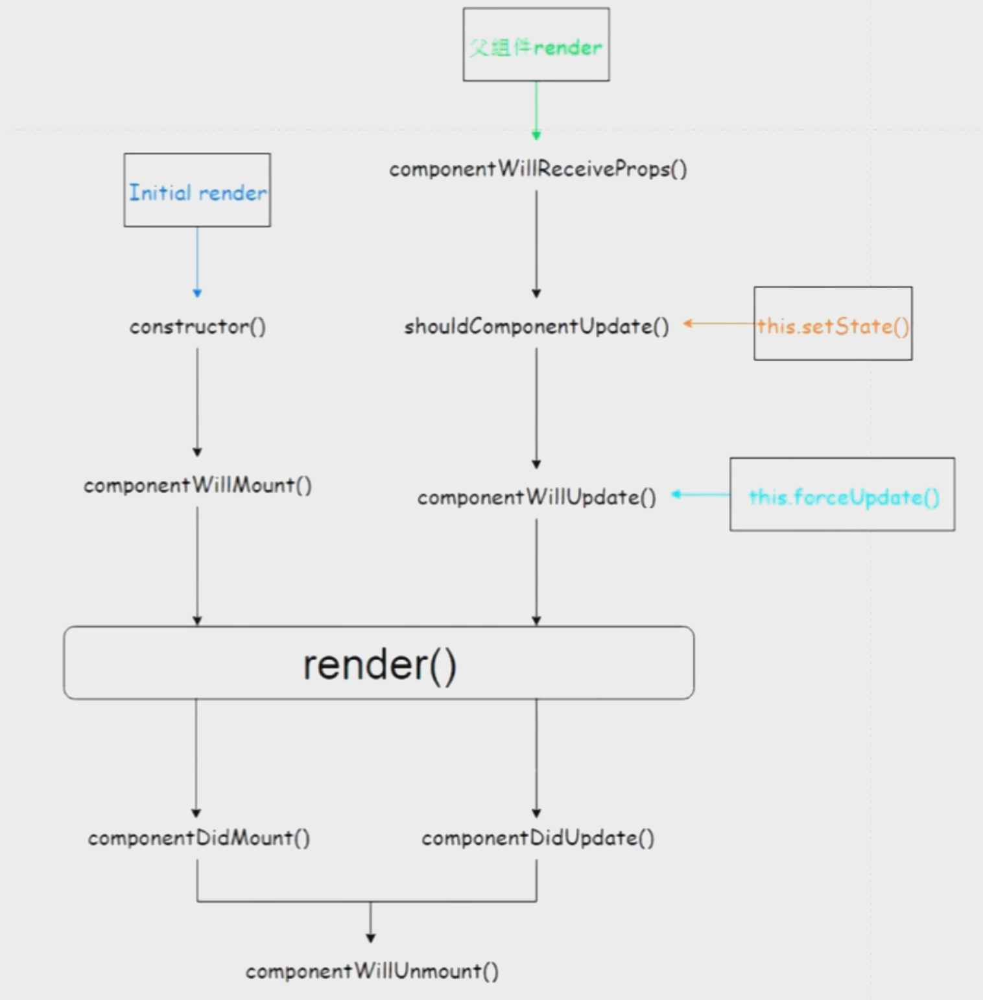

## state

```
class App extends Component {
  constructor (props) {
    super(props)
  
    this.state = {
      lists: ['ab', 'asd', 'dasd']
    }
  }

  addList = () => {
    console.log(123)
    this.setState({
      lists: [...this.state.lists, `reco${Math.random()}`]
    })
  }
  render () {
    return (
      <div> 
        <ul
          renderHeader={() => '列表'}>
          {
            this.state.lists.map(item => <li key={item}>{item}</li>)
          }
        </ul>
        <button type="primary" onClick={ this.addList }>add</button>
      </div>
    )
  }
}
```

按照ES7的提议，去掉constructor，state初始化可以不写在constructor里

```
class App extends Component {
  state = {
    lists: ['ab', 'asd', 'dasd']
  }

  addList = () => {
    console.log(123)
    this.setState({
      lists: [...this.state.lists, `reco${Math.random()}`]
    })
  }
  render () {
    return (
      <div> 
        <ul
          renderHeader={() => '列表'}>
          {
            this.state.lists.map(item => <li key={item}>{item}</li>)
          }
        </ul>
        <button type="primary" onClick={ this.addList }>add</button>
      </div>
    )
  }
}
```

## props

```
class App extends Component {
  render () {
    return <GetProps name="reco_luan"></GetProps>
  }
}

// 当然这里可以使用class来定义函数
function GetProps (props) {
  return <div>{props.name}</div>
}
```

## 事件的上下文

- 方法一
```
class App extends Component {
  constructor (props) {
    super(props)
    
    this.clickFun = this.clickFun.bind(this)
  }
  	
  clickFun () {
  	 console.log('click')
  }
  
  render () {
    return <button onClick={ this.clickFun }></button>
  }
}
```
- 方法二
```
class App extends Component {
  	
  clickFun () {
  	 console.log('click')
  }
  
  render () {
    return <button onClick={ () => this.clickFun() }></button>
  }
}
```
- 方法三
```
class App extends Component {
  constructor (props) {
    super(props)
    
    this.clickFun = this.clickFun.bind(this)
  }
  	
  clickFun = () => {
  	 console.log('click')
  }
  
  render () {
    return <button onClick={ this.clickFun }></button>
  }
}
```

## CSS Module

```js
import React, { Component } from 'react';
import Styles from './page2.scss';

export default class Page1 extends Component {
  render() {
    return (
      <div className={Styles.component}>bbb</div>
    );
  }
};
```

## 组件更新机制

1. react没个组件就是返回一个对象，这个对象里包括 ref、type等参数，每次更新，通过diff将需要删除、需要新增、需要修改的分别记录在不同的数组里来进行处理。

2. 有四种情况会出发组件的更新，首次加载、伏组件加载或更新、this.setState()、this.forceUpdate()，其中`shouldComponentUpdate()` 这个钩子如果返回true将继续向下运行，如果返回false将停止运行，在这里通过选择性地组织运行，就可以就行优化处理。





1. `shouldComponentUpdate(nextProps, nextState)` 我们可以通过nextProps和nextState来获取变化后的state和props，通过一些判断来选择性的返回 true和false，比如：

   ```js
   class AddNum extends ReactComponent () {
     constructor(props) {
       this.state = {
         num: 0
       }
     }
     
     shouldComponentUpdate (nextProps, nextState) {
       // 只有在是5的倍数时才会触发
   		if (nextState.num % 5 === 0) {
         return true
       }
       return false
     }
   }
   ```

   

2. setState会生成一个队列，也就是说异步的；初始化state时不要使用 this.state.a = 1；不要在render函数里触发setState，因为setState会触发render，这样会形成循环（除非有自己定制的shouldComponentUpdate）。

## 父组件直接调用子组件方法

```jsx
import React, {Component} from 'react'

export default class Parent extends Component {
    render() {
        return(
            <div>
                <Child onRef={this.onRef} />
                <button onClick={this.click} >click</button>
            </div>
        )
    }

    onRef = (ref) => {
        this.child = ref
    }

    click = (e) => {
        this.child.myName()
    }

}

class Child extends Component {
    componentDidMount(){
        this.props.onRef(this)
    }

    myName = () => alert('xiaohesong')

    render() {
        return ('woqu')
    }
}
```

## react组件中的constructor和super小知识

> 参考：https://www.cnblogs.com/faith3/p/9219446.html

如果constructor中不通过super来接收props，在其他生命周期，

诸如componentWillMount、componentDidMount、render中能直接使用this.props吗？？

结论：可以的，react在除了constructor之外的生命周期已经传入了this.props了，完全不受super(props)的影响。

所以super中的props是否接收，只能影响constructor生命周期能否使用this.props，其他的生命周期已默认存在this.props