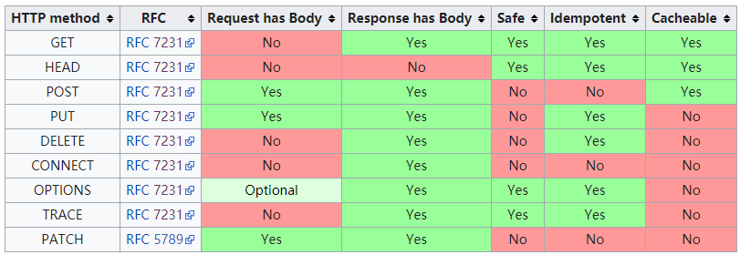

:::tip 目录
1. 主要特点
2. 报文组成
3. HTTP方法
4. POST和GET区别
5. HTTP状态码
6. 持久连接
7. 管线化
:::

## 特点

1. 简单快速：每个资源都有指定的URI，需要访问，只要输入URI即可
2. 灵活：每个HTTP请求的头部都会有一个 `content-type` ，可以传输不通类型的数据
3. 无连接：连接一次，就会断掉
4. 无状态：因为无连接，所以记不住上次连接的状态，所以每次请求都记不住用户的身份

## 保文组成

#### 请求报文

1. 请求行：http方法、请求地址、http协议以及版本
2. 请求头：key-value值，告诉服务器我要什么内容，注意什么格式
3. 空行：请求头与请求体的分隔标志
4. 请求体

#### 响应报文

1. 响应行：http协议以及版本、状态码、状态短语
2. 响应头
3. 空行
4. 响应体

## HTTP方法

- GET：获取资源
- POST：传输资源
- PUT：更新资源
- DELETE：删除资源
- HEAD：获取报文首部

## POST和GET区别

1. GET在浏览器回退时是无害的，POST会再次提交
2. GET请求会被浏览器主动缓存，POST不会
3. GET的请求参数会被保留在浏览器的历史记录中，POST不会
4. GET请求在URL中的传递的参数时有长度限制的，POST没有
5. GET参数放在URL中，而POST在请求体（---------以下不重要-------）
6. GET亲求的URL地址可以被收藏，POST不可以
7. GET只能进行URL编码，而POST支持多种编码方式
8. GET只接受ASCII字符，POST没有限制
9. GET参数放在URL中，可见，不安全

## HTTP状态码

1xx：指示信息。表示请求已接收，继续处理
2xx：成功。请求已被成功接收
3xx：重定向。要完成请求，必须更进一步操作
4xx：客户端错误。请求有语法错误或请求无法实现
5xx：服务器错误。服务器未能实现合法的请求

#### 具体状态码

1. 200 OK：请求成功
2. 206 Partial Content：客户发送了一个带有Range头的GET请求，服务器完成了它
3. 301 Moved Permanently：永久重定向
4. 302 Found：临时重定向
5. 304 Not Modified：可以使用缓存
6. 400 Bad Request：客户端有语法错误
7. 403 Forbidden：被禁止访问
8. 404 Not Found：资源不存在
9. 500 Internal Server Error：服务器发生不可预期的错误
10. 503 Server Unavailable：请求未完成

## 持久连接

HTTP协议采用“请求——应答”模式，当使用普通模式时，既非Keep-Alive模式时，每个请求/应答客户和服务器都要新建一个连接，完成后立即断开（HTTP协议无连接协议）。

当使用Keep-Alive模式时，使得连接持续有效，避免了建立和重新建立连接（HTTP/1.1才有的Keep-Alive）。

## 管线化

在使用持久连接的情况下，某个连接上的消息的传递类似于：请求1->响应1->请求2->响应2->请求3->响应3

管线化后，连接上的消息的传递类似于：请求1->请求2->请求3->响应1->响应2->响应3

#### 特点

1. 通过持久连接完成，仅支持HTTP/1.1以上
2. 只有GET和HEAD请求可以进行管线化，而POST有所限制
3. 初次创建连接时不应该启动管线机制，对方服务器可能不支持
4. HTTP/1.1协议要求服务器支持管辖化，但不要求进行管线化处理，只是要求对于管线化的请求不失败即可
5. 管线化很可能不能嗲来大幅度的性能提升，很多服务器支持并不好，现代浏览器Chrome和FireFox默认不开启

---

## HTTP番外篇

#### 请求过程

1. 建立TCP连接
2. web浏览器向web服务器发送请求命令
3. web浏览器发送请求头
4. web浏览器应答
5. web浏览器发送应答头信息
6. web浏览器像浏览器发送数据
7. web浏览器关闭TCP连接

#### 请求方法对比

这个对比找了好长时间了，我在delete到底有没有请求体、传参方式应该是怎样的这个问题上一直都有困惑，今天在想着要不然去维基百科查一下 `XMLHttpRequest` 的定义，果真看到的请求方法对比，下面是截图。

其中 [RFC7231](https://tools.ietf.org/html/rfc7231#section-4.3.5)协议原文中找到了相应的解释。

> A payload within a DELETE request message has no defined semantics;
   sending a payload body on a DELETE request might cause some existing
   implementations to reject the request.