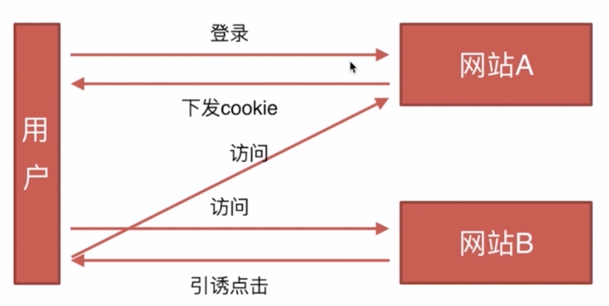

:::tip 目录
1. CSRF
    - 基本概念和缩写
    - 攻击原理
    - 防御措施
2. XSS
    - 基本概念和缩写
:::

## CSRF

#### 基本概念和缩写

通常成为跨站请求伪造，英文名字：Cross-site request forgery

#### 攻击原理

前提：
1. 某个接口确实存在这种漏洞
2. 用户在网站A确实处于登录状态

#### 防御措施

- Token 验证
- Referer验证
- 隐藏令牌

> 学习资料：https://www.cnblogs.com/hyddd/archive/2009/04/09/1432744.html

## XSS

#### 基本概念和缩写

Cross-site scripting跨域脚本攻击 

> https://www.imooc.com/learn/812

## 区别

CSRF是利用本身的漏洞自动触发接口，XSS是向页面注入js，然后在函数体中去操作 