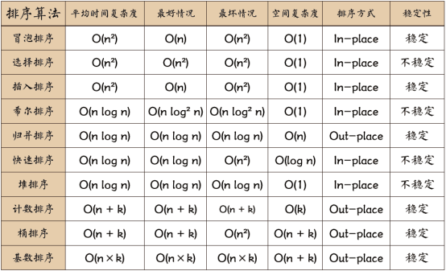

:::tip 目录
- 排序
- 堆栈、队列、链表
- 递归
- 波兰式和逆波兰式（数据结构）
:::

- 快速排序 https://segmentfault.com/a/1190000009426421
- 选择排序 https://segmentfault.com/a/1190000009366805
- 希尔排序 https://segmentfault.com/a/1190000009461832
- 冒泡排序

- 堆栈 https://juejin.im/entry/58759e79128fe1006b48cdfd
- 队列 https://juejin.im/entry/58759e79128fe1006b48cdfd
- 列表 https://juejin.im/entry/58759e79128fe1006b48cdfd

- 递归 https://segmentfault.com/a/1190000009857470

## 波兰式和逆波兰式

- 理论：https://www.cnblogs.com/chenying99/p/3675876.html
- 源码：https://github.com/Tairraos/rpn.js/blob/master/rpn.js