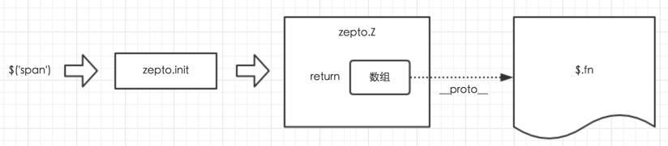

## javascript原型基础知识

1. 每个函数都有一个prototype属性；
2. 每个new出来的实例都一个隐式原型 `__proto__` 指向于函数的显式原型 `prototype` ；
3. 当实例上没有某个方法或属性的时候，就会去隐式原型上找；
4. 实例的隐式原型 `__proto__` 是可以修改的。

> 引用第三方cdn的时候使用 `//cdn.bootcss.com/zepto/1.2.0/zepto.js` ，目的是，不管用户使用的 `http` 还是 `https` ，均可以正常访问。

## Zepto结构

```js
var Zepto = (function () {
  var $

  // ...省略代码...

  $ = function (selector, context) {
    return zepto.init(selector, context)
  }

  // ...省略代码...

  return $
})()

window.Zepto = Zepto
window.$ === undefined $$ (window.$ = Zepto)
```

这样的一个好处就是将Zepto的内部变量封装在一个匿名函数内，避免全局污染。

## `Zepto.init` 函数

```js
var Zepto = (function () {
  var $,
    zepto = {}
    
  // ...省略代码...
    
  zepto.init = function (selector, context) {
    // 函数内容
  }
    
    
  $ = function (selector, context){
    return zepto.init(selector, context)
  }
    
  // ...省略代码...
    
  return $
})()

window.Zepto = Zepto
window.$ === undefined && (window.$ = Zepto)
```

#### `zepto.init` 函数大约有几十行代码，把中间的那些if...else...操作去掉，剩下的就是：

```js
zepto.init = function(selector, context) {
  var dom
    
  // ...此处省略N行...
    
  // create a new Zepto collection from the nodes found
  return zepto.Z(dom, selector)
}
```

中间省略的代码，都是根据不同条件下对dom变量进行赋值。dom从名字也可以猜测出来，它将会赋值一个或多个DOM节点。最终，它将通过selector一起传递给zepto.Z函数并返回值。

下面看看中间省略的代码：

```js
zepto.init = function(selector, context) {
  var dom
    
  // 分情况对dom赋值：
  // 1. selector 为空
  // 2. selector 是字符串，其中又分好几种情况
  // 3. selector 是函数
  // 4. 其他情况，例如 selector 是数组、对象等
    
    // create a new Zepto collection from the nodes found
  return zepto.Z(dom, selector)
}
```

1. 无参数，即$()

```js
// If nothing given, return an empty Zepto collection
if (!selector) return zepto.Z()
```

2. `selector` 参数是字符串，例如 `$('p')` ，`$('<div>')`，`$('#content')`

```js
else if (typeof selector == 'string') {
  selector = selector.trim()
  /*
   * 情况1
   * 参数为<div>这种形式，即是一个html标签的，那么dom变量会被赋值为用这个标签创建的DOM对象，就像dom = document.createElement('div')差不多。
   * 其中涉及到了fragmentRE和zepto.fragment两个我们尚未了解的东东，此处不要深究，知道这段代码的意思即可。
   * 注意，通过测试发现，这里给dom赋值的其实不是一个dom节点对象，而是被封装称了数组。
   */

注意，通过测试发现，这里给dom赋值的其实不是一个dom节点对象，而是被封装称了数组。
  if (selector[0] == '<' && fragmentRE.test(selector))
    dom = zepto.fragment(selector, RegExp.$1, context)selector = null
  /*
   * 情况2
   * 如果第二个参数有值，则先根据第二个参数生成zepto对象，然后再调用.find来获取，例如$('.item', '#content')这种用法。find方法是zepto对象的一个函数，API中用法的介绍。
   */
  else if (context !== undefined) return $(context).find(selector)
  // 情况3，以上两种情况都不是，则调用zepto.qsa来获取数据，后来聊这个方法的具体实现。qsa即querySelectAll的缩写
  else dom = zepto.qsa(document, selector)
}
```

3. `selector` 参数是函数，例如 `$(function(){...})`

```js
// If a function is given, call it when the DOM is ready
else if (isFunction(selector)) return $(document).ready(selector)
```

这种用法也比较常见，意思是待dom加载完毕再执行函数。这个ready函数的具体实现后面会讲到，这里先知道意思即可。

4. `selector` 本身就是个zepto对象
   
这种用法比较少，但是也不能避免，例如

```js
var a = $('p');
$(a);  // 这里传入的 a 本身就是个 zepto 对象了。
```

源码中使用zepto.isZ来判断，如果是的话，直接就返回自身。zepto.isZ的实现很简单，看源码即可

```js
// If a Zepto collection is given, just return it
else if (zepto.isZ(selector)) return selector
```
5. 其他情况

```js
else {
  // normalize array if an array of nodes is given
  if (isArray(selector)) dom = compact(selector)
  // Wrap DOM nodes.
  else if (isObject(selector))
    dom = [selector], selector = null
  // If it's a html fragment, create nodes from it
  else if (fragmentRE.test(selector))
    dom = zepto.fragment(selector.trim(), RegExp.$1, context), selector = null
  // If there's a context, create a collection on that context first, and select
  // nodes from there
  else if (context !== undefined) return $(context).find(selector)
  // And last but no least, if it's a CSS selector, use it to select nodes.
  else dom = zepto.qsa(document, selector)
}
```

**情况1** `selector` 参数是数组，则通过一个 `compact` 处理一下赋值给 `dom`

```js
// normalize array if an array of nodes is given
if (isArray(selector)) dom = compact(selector)
```

**情况2** `selector` 参数是DOM节点，则将它作为数组赋值给 `dom`

```js
// Wrap DOM nodes.
else if (isObject(selector))
  dom = [selector], selector = null
```

**剩余情况** 其实在selector是字符串的时候就已经考虑到了，因此感觉这里多余了。

```js
// If it's a html fragment, create nodes from it
else if (fragmentRE.test(selector))
  dom = zepto.fragment(selector.trim(), RegExp.$1, context), selector = null
// If there's a context, create a collection on that context first, and select
// nodes from there
else if (context !== undefined) return $(context).find(selector)
// And last but no least, if it's a CSS selector, use it to select nodes.
else dom = zepto.qsa(document, selector)
```

**最终，赋值给dom的形式是一个数组。就像这段代码**

```js
// Wrap DOM nodes.
else if (isObject(selector))
  dom = [selector], selector = null
```

## `Zepto.Z` 函数

```js
// `$.zepto.Z` swaps out the prototype of the given `dom` array
// of nodes with `$.fn` and thus supplying all the Zepto functions
// to the array. Note that `__proto__` is not supported on Internet
// Explorer. This method can be overriden in plugins.
zepto.Z = function(dom, selector) {
  dom = dom || []
  dom.__proto__ = $.fn
  dom.selector = selector || ''
  return dom
}
```

以上代码中，`dom` 是一个数组，并且把它的隐式原型赋值 `$.fn` ，而这里的 `$.fn` 其实就是一个普通的js对象，里面包含了各种各样的方法。最新的 `zepto.Z` 实现上目前不一样。

## 回顾



```js
var Zepto = (function (){
    var $,
        zepto = {}
    
    // ...省略代码...
    
    zepto.Z = function (dom, selector) {
      dom = dom || []
      dom.__proto__ = $.fn
      dom.selector = selector || ''
      return dom
    }
    
    zepto.init = function (selector, context) {
        var dom
        
        // 针对参数情况，分别对dom赋值
        
        // 最终调用 zepto.Z 返回的数据
        return zepto.Z(dom, selector)
    }
    
    $ = function (selector, context){
        return zepto.init(selector, context)
    }
    
    $.fn = {
        // 里面有若干个工具函数
    }
    
    // ...省略代码...
    
    return $
})()

window.Zepto = Zepto
window.$ === undefined && (window.$ = Zepto)
```