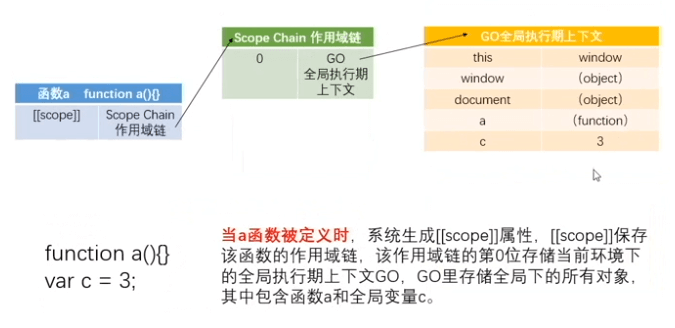
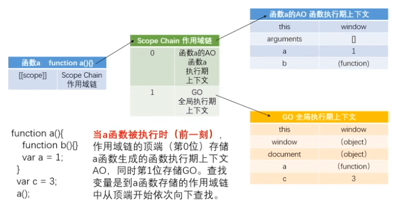
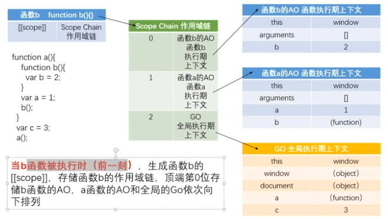
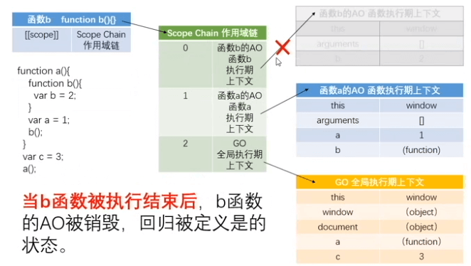
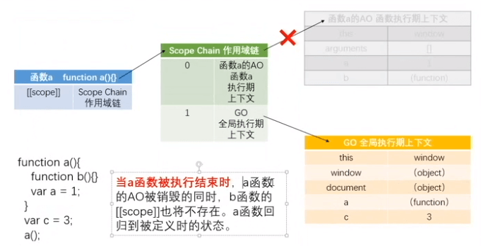
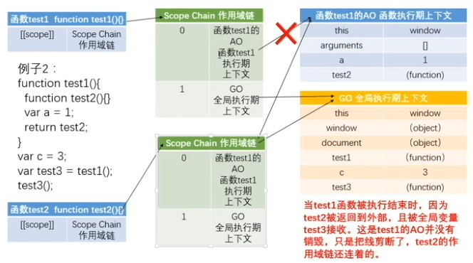
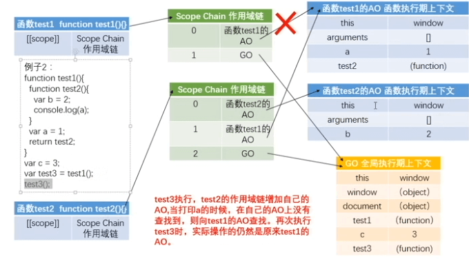
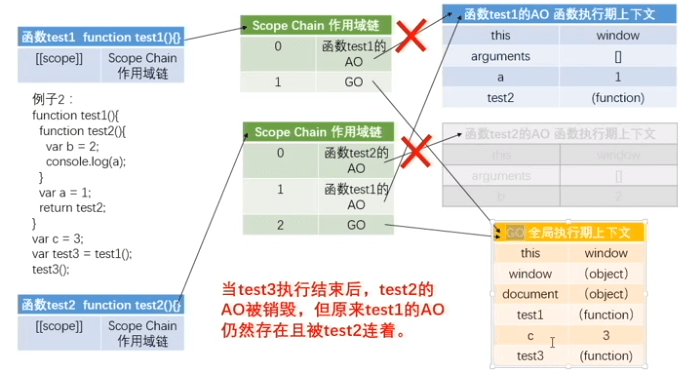

## 数据类型

- 值类型 值保存在栈内存 Stack 中
- 引用类型 值保存在堆内存 Heap 中，然后将堆内存的地址保存在栈内存中，并赋值给变量

## typeof

`typeof` 的结果都是字符串。

|案例|结果|
|-|:-:|
|`'1'`|string|
|`1`|number|
|`undefined`|undefined|
|false|boolean|
|Symbol(1)|symbol|
|`null` / {} / []|object|
|Array/Boolean/String/Number/...|function|


## 运算符

|案例|结果|
|-|:-:|
|+ '123'|123|
|- '123'|-123|

> (1, 2) `,` 也是运算符，永远返回最后一个 `,` 后面的值

## 显示类型转换

**Number()**

|案例|结果|
|-|:-:|
|123|123|
|'123'|123|
|'true' / 'a' / '1a' / 'a1' / undefined|NaN|
|true|1|
|false / null|0|

**parseInt()**

parseInt 只考虑将数字类型转化整型，不

|案例|结果|
|-|:-:|
|123|123|
|true / false / null /undefined|NaN|
|'3.14' / '3.15'|3|
|'123abc'|123|
|'abc123'|NaN|

parseInt 接受两个参数，第二个是radix（进制)

**parseFloat()**

|案例|结果|
|-|:-:|
|3.1415|3.1415|
|||

**toFixed()**

toFixed(2) 的结果

|案例|结果|
|-|:-:|
|3.1415|3.14|
|3.1465|3.15|

**toString()**

toString 接受两个参数，第二个是radix（进制)

数值、布尔值、对象、字符串和 Symbol 都有一个 toString() 方法，但是 null 和 undefined 没有。

**String()**

如果值有 toString() 方法，就会遵循起规则转化，如果是 `'null'` 返回 null，如果是 undefined 返回 `'undefined'`。

**Boolean()**

|案例|结果|
|-|:-:|
|null / undefined / NaN / '' / 0 / false |false|
|1|true| 

## 隐式类型转换

|案例|结果|
|-|:-:|
|a++ / a-- / * / `/` / % / = / !=|先 `Number(a)`|
|"a" + 1|先 `String(1)` 再 `'a' + '1'`|
|1 > '2' / '1' > 2 / '1' > '2' / < / <= / >=|先 `Number(1)`|
|'a' > 'b' / < / <= / >=|先转化 ascii 码|
|NaN == NaN / NaN === NaN|false|
|undefined < 0 / undefined > 0 / undefined = 0|false|
|null < 0 / null > 0 / null = 0|false|
|NaN == undefined|true|
|NaN === undefined|false|

**isNaN**

进行 Number() 转化

|案例|结果|
|-|:-:|
|1 / '1' / null|false|
|'a' / undefined / NaN|true|

## ASCII码

表1 0-127
表2 128-255

每个码1个字节

## UNICODE码

涵盖 ASCII 码，从256开始2个字节

str.charCodeAt(0) 查找字节数

**获取字节数**

```js
function getBytes (str) {
  let bytes = 0
  for( let i = 0; i < str.length; i++ ) {
    const pos = str.charCodeAt(i);
    if (pos < 255) {
      bytes++
    } else {
      bytes += 1
    }
  }

  return bytes
}
```

```js
// 精简
function getBytes (str) {
  let bytes = str.length
  for( let i = 0; i < str.length; i++ ) {
    const pos = str.charCodeAt(i);
    if (pos > 255) {
      bytes++
    }
  }

  return bytes
}
```

## 函数

一个固定的功能或者是程序段被封装的过程，实现一个固定的功能或者是程序

### 作用

- 耦合：重复代码太多
- 封装的原则：高内聚，低耦合  ->   模块的单一责任制
- 解耦合：函数，封装

### 变量定义

```js
function test () {
  var a = b = 1
  console.log(a, b)
}
test() // 1 1
console.log(b) // 1 因为相当于先 b = 1，再 var a = b，这样 b 就挂在 window 上了，外面是可以访问的
```

### 声明

函数声明有两种：函数声明和匿名函数表达式（也叫函数字面量）

函数表达式如果给匿名函数加上名字，名字在函数在是无法访问的，但在函数内可以

```js
var test = fuction test1 () {
  test1() // 运行
}
test1() // 报错
test() // 运行
```

### 参数

```js
var test = fuction (a, b) {
  console.log(test.length) // 获取形参的数量
  console.log(arguments.length) // 获取实参的数量
  // 获取函数本身，不推荐，因为递归调用会获取到不同的this值，用命名函数表达式可以解决
  console.log(arguments.callee) 
}
test(1)
```

> 实参没有传的值，形参是 undefined，无法修改，传递的实参就可以

#### 参数未知时的面试题

- 求和
- 依次打印

#### 参数默认值

**ES6**

```js
fuction test (a = 1, b = 2) {}

// 如果只想修改 b 的值，可以将 a 赋值 undefined
test(undefined, 4)
```

**ES5**

```js
fuction test (a, b) {
  // 方法1
  var a = arguments[0] || 1
  var b = arguments[1] || 2

  // 方法2，不推荐，推荐使用 arguments
  var a = a || 1
  var b = b || 2

  // 方法3
  var a = typeof(arguments[0]) !== 'undefined' ? arguments[0] : 1
  var b = typeof(arguments[1]) !== 'undefined' ? arguments[1] : 1
}
```

### return

函数末尾默认添加 return

### 全局变量和函数

变量未声明，使用会报错：xxx is not defined，可以使用 typeof(xxx) 先判断类型再使用，未声明则返回undefined

### 递归

```js
// 阶乘
// 1. 找到规律
// 2. 找到出口
fuction test (num) {
  if (num === 1) return 1
  return num * test(n - 1)
}
```

### 立即执行函数

IIFE - immediately-invoked function expression

```js
// 常见
(function () {

})()

// W3C推荐
(function () {

}())
```

**引申**

```js
// 报错
function () {
  console.log(1)
}()

// 1
var test = function () {
  console.log(1)
}()

// 报错
function () {
  console.log(1)
}()
```

```js
// 立即销毁
var test = function () {
  console.log(1)
}()
console.log(test)
// 1, 立即执行
// undefined, 立即执行后销毁
// 如果不是立即执行，会打印函数本身
```

```js
// 函数生命变表达式的方法：+ - ! || &&
+ function () {
  console.log(1)
}()
```

```js
function test () {
  console.log(1)
}(1)

// 打印 1，不报错，因为后面的小括号里面有值，小括号会理解为是一个表达式而不是立即执行函数
```

### call/apply

```js
function Car (brand, color) {
  this.brand = brand
  this.color = color
}
var newCar = {}

Car.call(newCar, 'benz', 'black')
// 或者 Car.apply(newCar, ['benz', 'black'])

console.log(newCar) // { brand: 'benz', color: 'black' }
```

```js
function Computed () {
  this.plus = function (a, b) {
    console.log(a + b)
  }
  this.minus = function (a, b) {
    console.log(a - b)
  }
}

function FullCompute () {
  Computed.apply(this)

  this.mul = function (a, b) {
    console.log(a * b)
  }
  this.div = function (a, b) {
    console.log(a / b)
  }
}

const compute = new FullCompute()
compute.plus(1, 2)
compute.minus(1, 2)
compute.mul(1, 2)
compute.div(1, 2)
```

### callee/caller

> callee/caller/arguments 在严格模式下都不能用

```js
function test (a, b, c) {
  console.log(arguments.callee) // arguments 对应的函数本身
  console.log(test.length) // 形参的长度
  console.log(arguments.callee.length) // 形参的长度
  console.log(arguments.length) // 实参的长度
}
```

```js
// 递加
function test (n) {
  if n <= 1 return 1
  return n + test(n - 1)
}

// arguments.callee
var sum = (function (n) {
  if n <= 1 return 1
  return n + arguments.callee(n - 1)
})(5)
```

```js
// caller返回调用当前函数的函数
test1()
function test1 () {
  test2()
}
function test2 () {
  console.log(test2.caller) // test1函数
}
```

## 预编译、作用域、作用域链

### 预编译

1. 检查通篇的语法错误
2. 预编译
3. 解释一行，执行一行

### 变量声明提升

var 声明变量和 function 声明函数都是会提升到上面的，也就是说：

```js
console.log(a) // undefined
var a = 1

// 实际执行顺序是：声明会提升
var a
console.log(a) // undefined
a = 1
```

### 暗示全局变量 imply global variable

```js
// 最外层的变量不管是否声明均挂在 window 上（仅针对 var）
var a = 1
b = 2

console.log(window.a, window.b) // 1, 2
```

```js
// 函数里面没有声明的变量会挂在 windows 上
function test () {
  var a = b = 1
}
test()
console.log(window.b) // 1
console.log(window.a) // undefined，如果直接访问 a 会报错
```

### GO, AO

预编译不看代码执行对代码的影响，比如如果有 if 语句，忽略不计。

**1**

```js
function test () {
  return a
  a = 1
  function a () {}
  var a = 2
}

console.log(test())

/**
 * AO = {
 *   a: undefined -> 
 *      ƒ a () {}
 * }
 */
```

**2**

```js
function test () {
  a = 1
  function a () {}
  var a = 2
  return a
}

console.log(test())

/**
 * AO = {
 *   a: undefined -> 
 *      ƒ a () {} ->
 *      1 ->
 *      2
 * }
 */
```

**3**

```js
a = 1
function test (e) {
  function e () {}
  arguments[0] = 2
  console.log(e)
  if (a) {
    var b = 3
  }

  var c
  a = 4
  var a
  console.log(b)
  f = 5
  console.log(c)
  console.log(a)
}
var a
console.log(f) // 5 函数内的没有通过 var 声明，直接提到 GO 中，省略 undefined 过程
test(1)

console.log(a)
console.log(f)

/**
 * GO = {
 *   a: undefined -> 
 *      1
 *   test: f test () {}
 *   f = 5
 * }
 * AO = {
 *   e: undefined ->
 *      1 -> 
 *      f e () {} ->
 *      2
 *   b: undefined
 *   c: undefined
 *   a: undefined ->
 *      4
 * }
 */
```

**3**

```js
console.log(a)  //functiona(){   var a = 'a';}
// a = 'test';

function a(){
  console.log(b)
  a = 'a'; // 暗示全局变量
  function b (){}
}
a(); 
console.log(a)
```

**GO (Global Object)**

- 全局预编译GO(Global Object)
  - 创建GO对象
  - 给全局变量赋值 undefined GO{a: undefined}
  - 将全局的函数声明的函数名作为key,value为函数整体赋值到GO对象中
  - 执行过程中赋值
    ```js
    GO{a:function a(){
    ​ console.log(b)
    ​ a = 'a'; // 暗示全局变量
    ​ function b (){}
    }}

    // GO === window
    /**
     * GO = {
     *   a: undefined => function a () {} => 1
     * }
     */
    ```

```js 

```

```js 
console.log(a, b) // undefined, f b () { console.log(1) }
var a = 1
function b (){
  console.log(1)
}
```

**AO (Activation Object)**

- 函数预编译AO (Activation Object  活跃对象  活跃函数上下文)
  1. 创建AO对象
  2. 将函数内的形参和变量声明存储到AO对象中，值为undefined
  3. 将实参赋值给形参
  4. 将函数内的函数声明的名称赋值
  5. 执行过程中赋值

```js
function test (a) {
  console.log(a) // ƒ a () {}
  var a = 1
  console.log(a) // 1
  function a () {}
  console.log(a) // 1
  var b = function () {}
  console.log(b) // ƒ () {}
  function d () {}
}

test(2)

/**
 * AO = {
 *   a: undefined => 
 *      2 ->
 *      function a () {} => 
 *      1,
 *   b: undefined -> 
 *      function () {},
 *   d: undefined -> 
 *      function () {}
 * }
 */
```

```js
function test (a, b) {
  console.log(a) // 1
  c = 0
  var c
  a = 5
  b = 6
  console.log(b) // 6
  function b () {}
  function d () {}
  console.log(b) // 6
}

test(1)

/**
 * AO = {
 *   a: undefined -> 
 *      1 ->
 *      5,
 *   b: undefined -> 
 *      function () {} ->
 *      6,
 *   c: undefined -> 
 *      0,
 *   d: undefined -> 
 *      function d () {}
 * }
 */
```

### 作用域、作用域链

AO 是和函数有关，函数又是一个独立空间。

对象，有属性有方法：

```js
const recoObj = {
  name: 'reco_luan',
  address: '北京',
  say: function () {
    console.log("I'm reco_luan!")
  }
}

console.log(recoObj.name)
recoObj.say()
```

其实函数也可以认为是一个对象类型（引用类型、引用值），因为它也有自己的属性和方法。

对象有些属性是我们无法访问的，它们是 JS 引擎内部固有的隐式属性。研究隐式属性就可以了解原理和在上层更好地写代码。隐式属性 `[[scope]]` 是什么呢：

1. 是函数创建时，生成的一个 JS 内部的隐式属性
2. 是函数存储作用域链的容器，作用域链又是什么呢：
   1. AO/GO
   2. AO，函数执行期上下文
   3. GO，全局执行期上下文
   4. 函数执行完成以后，AO 是要销毁的，所以 AO 是一个即时的存储容器
   5. 所以作用域链就是把 AO/GO 从上到下排列起来，形成链式，这个链式关系就是作用域链

下面用一个案例来讲一下：

```js
function a () {
  function b () {
    var b = 2
  }
  var a = 1
  b()
}
var c = 3
a()
```

**当函数 `a` 被定义时**，系统生成 `[[scope]]`，`[[scope]]` 保存该函数的作用域，该作用域的第 0 位存储当前环境下的全局执行期上下文 GO，GO 里存储全局下的所有对象，其中包含函数 a 和全局变量 c（此时还没有形成 AO）。



每个函数的作用域是包含 GO 的（实际是 GO 的内存地址，因为 GO 是对象，是引用类型）。

**当函数 `a` 被执行时（前一刻）**，作用域链的顶端（第 0 位）存储函数 `a` 生成的函数执行期上下文 AO，同时第 1 位存储 GO。查找变量是到函数 a 存储的作用域链中从顶端开始依次向下找。



**当函数 `b` 被执行时（前一刻）**，生成函数 `b` 的 `[[scope]]`，存储函数 `b` 的 AO，函数 `a` 的 AO 和全局的 GO 依次向下排列。



**当函数 `b` 被执行结束后**，生成函数 `b` 的 AO 被销毁，回归被定义时的状态。



**当函数 `a` 被执行结束时**，生成函数 `a` 的 AO 被销毁的同时，函数 `b` 的 `[[scope]]` 也将不存在。函数 `a` 回归到被定义时的状态。



```js
function a () {
  function b () {
    function c () {}
    c()
  }
  b()
}
a()

/**
 * a 定义：a.[[scope]] -> 0: GO
 * a 执行：a.[[scope]] -> 0: a -> AO
 *                       1: GO
 * b 定义：b.[[scope]] -> 0: a -> AO
 *                       1: GO
 * b 执行：b.[[scope]] -> 0: b -> AO
 *                       1: a -> AO
 *                       2: GO 
 * c 定义：c.[[scope]] -> 0: b -> AO
 *                       1: a -> AO
 *                       2: GO 
 * c 执行：c.[[scope]] -> 0: c -> AO
 *                       1: b -> AO
 *                       2: a -> AO
 *                       3: GO 
 * c 结束：c.[[scope]] -> 0: b -> AO
 *                       1: a -> AO
 *                       2: GO 
 * b 结束：b.[[scope]] -> 0: a -> AO
 *                       1: GO
 *        c.[[scope]] 随之消失
 * a 结束：a.[[scope]] -> 0: GO
 *        b.[[scope]] 随之消失
 *        c.[[scope]] 随之消失
 */
```

### 作用域的使用——闭包

**当函数 `test1` 被执行结束时，因为 test2 被返回到外部，且被全局变量 test3 接收。这是 test1 的 AO 并没有销毁，只是把钱剪断了，test2 的作用域链还连着的。**



**`test3` 执行结，test2 的作用域链增加自己的 AO，当打印 a 时，在自己的 AO 上没有查找到，则向 test1 的 AO 查找。再次执行 test3 时，实际操作的仍然是原来 test1 的 AO。**



**`test3` 执行结束后，test2 的 AO 被销毁，原来 test1 的 AO 仍然存在且被 test2 连着。**



当内部函数被返回到外部并保存时，一定会产生闭包，闭包会产生原来的作用域不释放，过度的闭包可能会导致内存泄漏，或加载过慢。

## 闭包

> 闭包是指有权访问另一个函数作用域中的变量的函数，内层函数会保存并共享外层函数的 AO。

### 案例1

```js
function counter (initNum = 0) {
  let num = initNum
  const func = {
    add () {
      num++
    },
    cut () {
      num--
    },
    value () {
      return num
    }
  }
  return func
}

const newCounter = counter(2)
newCounter.add() // 3
newCounter.add() // 4
newCounter.cut() // 3
console.log(newCounter.value()) // 3
```

### 案例2

```html
<ul>
  <li>1</li>
  <li>2</li>
  <li>3</li>
  <li>4</li>
  <li>5</li>
  <li>6</li>
</ul>

<script>
  const list = document.querySelectorAll('ul li')
  for (var i = 0; i < list.length; i++) {
    list[i].addEventListener('click', () => {
      console.log(i, list[i]) // 6 undefined
    }, false)
  }
</script>
```

**原因**

js的实际的运行结果如下：

```js
const list = document.querySelectorAll('ul li')
var i = 0
for (; i < list.length;) {
  list[i].addEventListener('click', () => {
    console.log(i, list[i]) // 6 undefined
  }, false)
  i++
}
```

因为函数不是立即运行，所以等到点击触发的时候，`i` 已经变成了 `6`，并且每个函数都共享这个 `i`，为了使每次点击时获取到的是当前的实际下标，需要给添加事件的代码外层包裹一个立即执行函数来形成闭包，并将下标值以参数的形式传入并保存（见解决1）。

因为 `let` 有块级作用域，可以使用 `let` 代替 `var`（见解决2）.

**解决1** 立即运行函数，形成闭包

```html
<ul>
  <li>1</li>
  <li>2</li>
  <li>3</li>
  <li>4</li>
  <li>5</li>
  <li>6</li>
</ul>

<script>
  const list = document.querySelectorAll('ul li')
  for (var i = 0; i < list.length; i++) {
    (j => {
      list[j].addEventListener('click', () => {
        console.log(j, list[j]) // 4 <li>5</li>
      }, false)
    })(i)
  }
</script>
```

**解决2** `let` 代替 `var`

```html
<ul>
  <li>1</li>
  <li>2</li>
  <li>3</li>
  <li>4</li>
  <li>5</li>
  <li>6</li>
</ul>

<script>
  const list = document.querySelectorAll('ul li')
  for (let i = 0; i < list.length; i++) {
    list[i].addEventListener('click', () => {
      console.log(i, list[i]) // 4 <li>5</li>
    }, false)
  }
</script>
```

## 对象

### 增删查改

```js
let person = {
  name: 'reco_luan',
  address: 'BeiJing',
  eat () {
    console.log(`I'm eating!`)
  }
}

// 增（点语法）

person.age = 18

person.say = function () {
  console.log(`I'm reco!`)
}

// 删（delete 关键字和点语法）

delete person.age

delete person.say // 切记不要 delete person.say()，这样只会执行

// 查（点语法）

console.log(person.name)

// 改（点语法）

person.name = 'reco'
```

### 对象属性的访问

```js
// 通过对象名字可以在方法内回去对象的属性和方法
const counter = {
  num: 10,
  add () {
    counter.num++
  },
  cut () {
    counter.num--
  }
}

// 这样在内部用外部的名字访问显得并不是特别友好，所以可以换为 this，this 就是对象本身
const counter = {
  num: 10,
  add () {
    this.num++
  },
  cut () {
    this.num--
  }
}
```

### 访问带参数的方法

```js
const attendance = {
  students: [],
  total: 6,
  join (name) {
    this.students.push(name)
    if (this.students.length !== 6) {
      console.log(`${name} 到课，学生未到齐`)
    } else {
      console.log(`${name} 到课，学生已到齐`)
    }
  },
  leave (name) {
    const idx = this.students.indexOf(name)
    if (idx !== -1) {
      this.students.splice(idx, 1)
      console.log(`${name} 早退`)
    }
  },
  classOver () {
    this.students = []
    console.log('下课了')
  }
}

attendance.join('张三')
attendance.join('李四')
attendance.join('王五')
attendance.join('赵六')
attendance.join('韩七')
attendance.join('麻八')
attendance.leave('张三')
attendance.join('张三')
attendance.classOver()
```

### 对象的创建方法总结

**1. 对象字面量**

```js
const obj = {
  name: '张三',
  age: 6
}

console.log(obj.name)
```

**2. 内置构造函数 Object**

同 `对象字面量` 效果一致，完全相等。

```js
const obj = new Object()
obj.name = '张三'
obj.age = 6

console.log(obj.name)
```

**3. 自定义构造函数**

构造函数里的 `this` 在定义时并没有，GO/AO 并不看这个，在下面实例化的时候才产生，所以 `this` 就是实例本身`，谁实例就是谁。**但是如果不实例化而直接运行的话，this 则指向 window**

每次实例都会产生一个不同的对象。

```js
function People () {
  this.name = '张三'
  this.age = 18
  this.smoke = function () {
    console.log(`I'm smoking`)
  }
}

const people = new People()
```

### 构造函数传参

**1. 依次排列**

- 优点：简洁
- 缺点：顺序不可以颠倒，参数较多时不易维护

```js
function People (name, age) {
  this.name = name
  this.age = age
  this.smoke = function () {
    console.log(`I'm smoking`)
  }
}

const people = new People('张三', 18)
```

**2. 设置对象**

- 优点：顺序可以颠倒，参数较多时易维护
- 缺点：参数较少时略显复杂（可忽略不计）

```js
function People (options) {
  this.name = options.name
  this.age = options.age
  this.smoke = function () {
    console.log(`I'm smoking`)
  }
}

const people = new People({
  name: '张三', 
  age: 18
})
```

### 构造函数的原理

```js
function Car (color, brand) {
  this.color = color
  this.brand = brand
}

const car1 = new Car('red', 'Benz')

console.log(car1.color) // red
```

**1. GO生成**

```js
/**
 * GO = {
 *   Car: f () {} ,
 *   car1: undefined =>
 *         this 对象
 * }
 */
```

**2. Car 实例化，函数运行，生成 AO**

```js
/**
 * AO = {
 *   this: {
 *     color: color,
 *     brand: brand
 *   }
 * }
 */
```

**3. new 的过程也就是：**

1. 先生成一个 this 对象
2. 将 this 对象返回出去
3. 最后将 this 对象赋值给实例

```js
function Car (color, brand) {
  /** 
   * 1. 先生成一个 this 对象
   * this: {
   *   color: color,
   *   brand: brand
   * }
   */
  this.color = color
  this.brand = brand
  /** 
   * 2. 将 this 对象返回出去
   * return this
   */
}
```

**4. 模拟一个 new 的过程**

```js
function Car (color, brand) {
  const me = {
    color: color,
    brand: brand
  }
  
  return me
}

// 这时不用 new 也可以了
const car1 = Car('red', 'Benz')
```

**5. 返回引用类型影响构造函数工作**

只有 `引用类型` 会影响构造函数的实例化。

```js
// 可以正常执行
function Car (color, brand) {
  this.color = color
  this.brand = brand

  return 123
}

// 返回 {}，返回结果会被 {} 覆盖
function Car (color, brand) {
  this.color = color
  this.brand = brand

  return {}
}
```